<!-- TOC -->

- [Theory](#theory)
    - [Generative Adversarial Nets](#generative-adversarial-nets)
        - [Main idea](#main-idea)
        - [Architecture](#architecture)
        - [Global Optimality](#global-optimality)
        - [Training](#training)
        - [Advantages and disadvantages](#advantages-and-disadvantages)
    - [f-GAN:Training Generative Neural Samplers usingVariational Divergence Minimization](#f-gantraining-generative-neural-samplers-using-variational-divergence-minimization)
        - [Main idea](#main-idea)
        - [f-divergence](#f-divergence)
        - [Variational Estimation](#variational-estimation)
        - [Variational Divergence Minimization](#variational-divergence-minimization)
        - [Algorithms for VDM](#algorithms-for-vdm)
        - [Experiments](#experiments)
    - [Conditional Generative Adversarial Nets](#conditional-generative-adversarial-nets)
        - [Main idea](#main-idea)
        - [Motivation](#motivation)
        - [CGAN](#cgan)
        - [Experiments](#experiments)
    - [InfoGAN: Interpretable Representation Learning by Information Maximizing Generative Adversarial Nets](#infogan-interpretable-representation-learning-by-information-maximizing-generative-adversarial-nets)
        - [Main idea](#main-idea)
        - [Mutual Information](#mutual-information)
        - [Variational Mutual Information Maximization](#variational-mutual-information-maximization)
        - [Architecture](#architecture)
        - [Experiments](#experiments)
    - [ENERGY-BASED GENERATIVE ADVERSARIAL NETWORKS](#energy-based-generative-adversarial-networks)
        - [Main idea](#main-idea)
        - [EBGAN](#ebgan)
        - [EBGAN USING AUTO-ENCODERS](#ebgan-using-auto-encoders)
    - [BEGAN: Boundary Equilibrium GenerativeAdversarial Networks](#began-boundary-equilibrium-generative-adversarial-networks)
        - [Main idea](#main-idea)
        - [Auto-encoders loss](#auto-encoders-loss)
        - [Wasserstein distance lower bound](#wasserstein-distance-lower-bound)
        - [GAN objective](#gan-objective)
        - [Equilibrium](#equilibrium)
        - [Boundary Equilibrium GAN](#boundary-equilibrium-gan)
        - [Convergence measure](#convergence-measure)
    - [Wasserstein GAN](#wasserstein-gan)
        - [Main idea](#main-idea)
        - [analysis](#analysis)
        - [Wasserstein distance](#wasserstein-distance)
        - [Wasserstein GAN](#wasserstein-gan)
        - [Training](#training)
        - [Experiments](#experiments)
    - [Improved Training of Wasserstein GANs](#improved-training-of-wasserstein-gans)
        - [Main idea](#main-idea)
        - [Difficulties of WGAN](#difficulties-of-wgan)
        - [WGAN-GP](#wgan-gp)
    - [Loss-Sensitive Generative Adversarial Networkson Lipschitz Densities](#loss-sensitive-generative-adversarial-networks-on-lipschitz-densities)
        - [Main idea](#main-idea)
        - [Motivation](#motivation)
        - [Loss-Sensitive GAN](#loss-sensitive-gan)
        - [Algorithm](#algorithm)
    - [Are GANs Created Equal? A Large-Scale Study](#are-gans-created-equal-a-large-scale-study)
        - [Main idea](#main-idea)
        - [Motivation](#motivation)
        - [Flavors of GAN](#flavors-of-gan)
        - [Metrics](#metrics)
        - [Large-scale Experimental Evaluation](#large-scale-experimental-evaluation)
- [Networks](#networks)
    - [Deep Generative Image Models using a Laplacian Pyramid of Adversarial Networks](#deep-generative-image-models-using-a-laplacian-pyramid-of-adversarial-networks)
        - [Main idea](#main-idea)
        - [Laplacian Pyramid](#laplacian-pyramid)
        - [LAPGAN](#lapgan)
        - [Thinking](#thinking)
    - [Unsupervised Representation Learning with Deep Convolutional Generative Adversarial](#unsupervised-representation-learning-with-deep-convolutional-generative-adversarial)
        - [Main idea](#main-idea)
        - [Architecture](#architecture)
        - [Experiments](#experiments)
    - [Improved Techniques for Training GANs](#improved-techniques-for-training-gans)
        - [Main idea](#main-idea)
        - [Feature Matching](#feature-matching)
        - [Minibatch Discrimination](#minibatch-discrimination)
        - [Historical averaging](#historical-averaging)
        - [One-sided label smoothing](#one-sided-label-smoothing)
        - [Virtual batch normalization](#virtual-batch-normalization)
        - [Assessment of image quality](#assessment-of-image-quality)
        - [Semi-supervised learning](#semi-supervised-learning)
    - [Generative Image Modeling using Style andStructure Adversarial Networks](#generative-image-modeling-using-style-and-structure-adversarial-networks)
        - [Main idea](#main-idea)
        - [Structure-GAN](#structure-gan)
        - [Style-GAN](#style-gan)
        - [Style-GAN with Pixel-wise Constraints](#style-gan-with-pixel-wise-constraints)
        - [Joint Learning for S2-GAN](#joint-learning-for-s2-gan)
        - [Experiments](#experiments)
    - [Pose Guided Person Image Generation](#pose-guided-person-image-generation)
        - [Main idea](#main-idea)
        - [Architecture](#architecture)
        - [Stage-I:Pose integration](#stage-ipose-integration)
        - [Stage-II:Image refinement](#stage-iiimage-refinement)
        - [Stage-III: Discriminator](#stage-iii-discriminator)
    - [Learning from Simulated and Unsupervised Images through Adversarial Training](#learning-from-simulated-and-unsupervised-images-through-adversarial-training)
        - [Main idea](#main-idea)
        - [Architecture](#architecture)
        - [Adversarial Loss with Self-Regularization](#adversarial-loss-with-self-regularization)
        - [Local adversarial loss](#local-adversarial-loss)
        - [perceptual loss](#perceptual-loss)
        - [Loss function](#loss-function)
- [Image translation](#image-translation)
    - [Coupled Generative Adversarial Networks](#coupled-generative-adversarial-networks)
        - [Main idea](#main-idea)
        - [Architecture](#architecture)
        - [Models](#models)
        - [Learning](#learning)
    - [Image-to-image translation using conditional adversarial nets](#image-to-image-translation-using-conditional-adversarial-nets)
        - [Main idea](#main-idea)
        - [Objective](#objective)
    - [StarGAN: Unified Generative Adversarial Networks for Multi-Domain Image-to-Image Translation](#stargan-unified-generative-adversarial-networks-for-multi-domain-image-to-image-translation)
        - [Main idea](#main-idea)
        - [Motivation](#motivation)
        - [Overview](#overview)
        - [Loss function](#loss-function)
        - [Training with Multiple Datasets](#training-with-multiple-datasets)
- [Face Generative and Editing](#face-generative-and-editing)
    - [Learning Residual Images for Face Attribute Manipulation](#learning-residual-images-for-face-attribute-manipulation)
        - [Main idea](#main-idea)
        - [Architecture](#architecture)
        - [Loss function for G](#loss-function-for-g)
        - [Loss function for D](#loss-function-for-d)
        - [Experiments](#experiments)
    - [Age Progression/Regression by Conditional Adversarial Autoencoder](#age-progressionregression-by-conditional-adversarial-autoencoder)
        - [Main idea](#main-idea)
        - [CAAE](#caae)
        - [Objective Function](#objective-function)
        - [Experiments](#experiments)
    - [Disentangled Representation Learning GAN for Pose-Invariant Face Recognition](#disentangled-representation-learning-gan-for-pose-invariant-face-recognition)
        - [Main idea](#main-idea)
        - [Architecture](#architecture)
        - [Single-Image DR-GAN](#single-image-dr-gan)
        - [Multi-Image DR-GAN](#multi-image-dr-gan)
        - [Experiments](#experiments)
    - [Tag Disentangled Generative Adversarial Networks for Object Image Re-rendering](#tag-disentangled-generative-adversarial-networks-for-object-image-re-rendering)
        - [Main idea](#main-idea)
        - [Motivation](#motivation)
        - [Architecture](#architecture)
        - [Consistency between images and tags](#consistency-between-images-and-tags)
        - [rendering](#rendering)
        - [Training Process](#training-process)
- [Image Inpainting](#image-inpainting)
    - [Semantic Image Inpainting with Deep Gnerative Models](#semantic-image-inpainting-with-deep-gnerative-models)
        - [Main idea](#main-idea)
        - [Architecture](#architecture)
        - [Experiments](#experiments)
    - [Generative Face Completion](#generative-face-completion)
        - [Main idea](#main-idea)
        - [Architecture](#architecture)
        - [Loss](#loss)
        - [Training](#training)
- [Super-Resolution](#super-resolution)
    - [Photo-Realistic Single Image Super-Resolution Using a Generative AdversarialNetwork](#photo-realistic-single-image-super-resolution-using-a-generative-adversarial-network)
        - [Main idea](#main-idea)
        - [Architecture](#architecture)
        - [Generator](#generator)
        - [MSE loss and VGG loss](#mse-loss-and-vgg-loss)
        - [Discriminator](#discriminator)
        - [Experiments](#experiments)
- [3D](#3d)
    - [Learning a Probabilistic Latent Space of Object Shapes via 3D Generative-Adversarial Modeling](#learning-a-probabilistic-latent-space-of-object-shapes-via-3d-generative-adversarial-modeling)
        - [Main idea](#main-idea)
        - [3D-GAN](#3d-gan)
        - [3D-VAE-GAN](#3d-vae-gan)
        - [Experiments](#experiments)

<!-- /TOC -->

# Theory
## Generative Adversarial Nets
### Main idea
1. The authors propose a net framework for estimating generative models via an adversarial process: a generative model G that captures the data distribution, and a discriminative model D that estimates the probability that a sample came from the training data rather than G.

2. G and D are defined by multilayer perceptrons, the entire system can be trained simultaneously with backpropagation. There is no need for any Markov chains or unrolled approximate inference networks during either training or generation of samples.

3. In the space of arbitrary functions G and D, a unique solution exists, with G recovering the training data distribution and D equal to ½ everywhere.

### Architecture

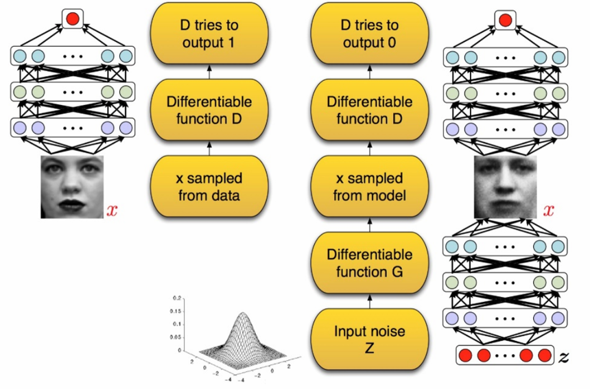

To learn the generator’s distribution P(g) over data x, we train D to maximize the probability of assigning the correct label to both training examples x and samples from G, and simultaneously train G to minimize log(1 − D(G(z))).

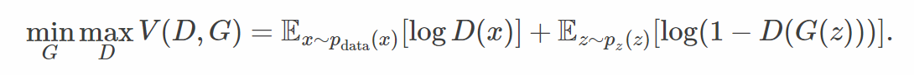

### Global Optimality
step 1: For G fixed, the optimal discriminator D is to maximize V(D,G), which can be interpreted as maximizing the log-likehood for estimating the conditional probability P(Y=y|x).

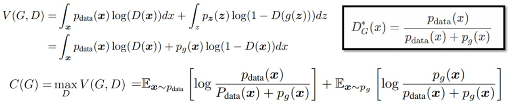

step 2: For D fixed, the optimal generator G is to minimize C(G). Since the Jensen–Shannon divergence between two distributions is always non-negative and zero, only when they are equal, we have shown that C∗ = −log(4) is the global minimum of C(G) and that the only solution is p(g) = p(data)

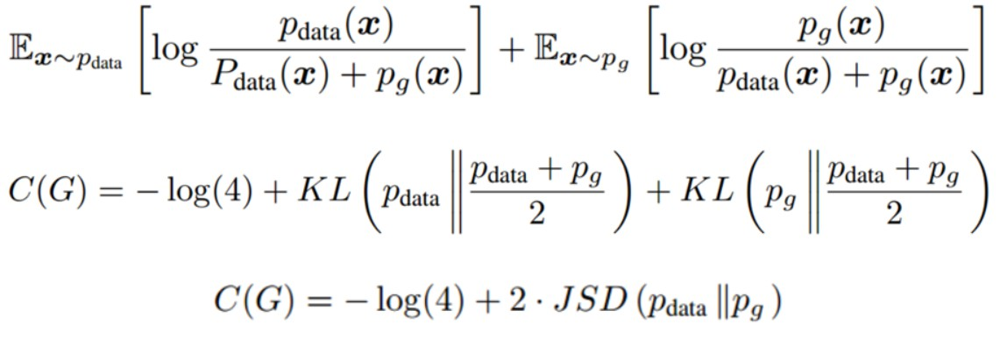

### Training

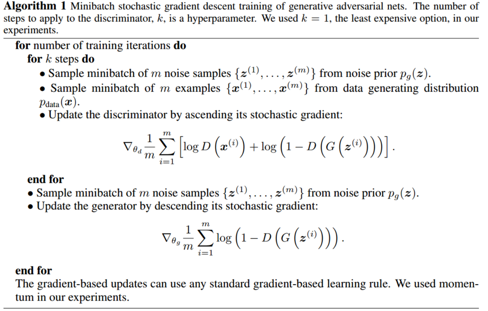

(1) Rather than training G to minimize log(1 − D(G(z))) we can train G to maximize log D(G(z))

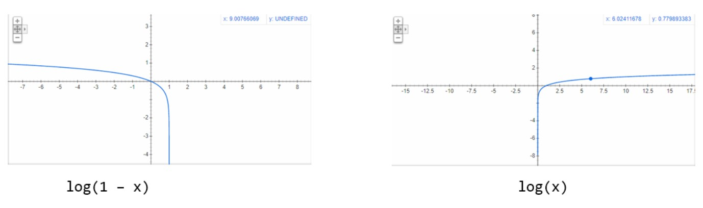

(2) With sufficiently small updates of G, P(g) converges to P(x)

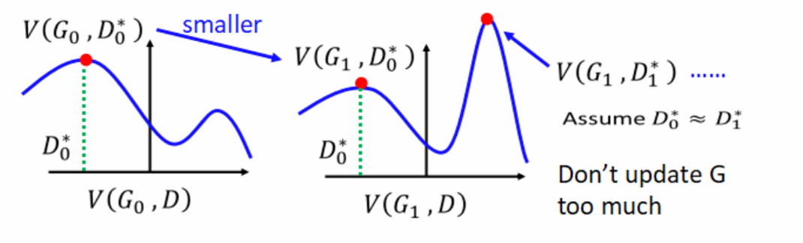

### Advantages and disadvantages

(1) Computational advantage: no Markov chains, backprop, no inference
 
(2) Statistical advantage: no copies, representing ability

(3) Disadvantages: non-convergence, collapse problem, uncontrollable

## f-GAN:Training Generative Neural Samplers usingVariational Divergence Minimization

### Main idea
The authors show that the generative-adversarial approach is a special case of an existing more general variational divergence estimation approach, where any f-divergence can be used for training generative neural samplers.

### f-divergence
Statistical divergences measure the difference between two given probability distribution. Given two distribution P and Q that posses an absolutely continuous density function p and q, we define the f-divergence,

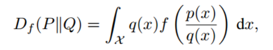

where the generator function f is convex, lower-semicontinuous function satisfying f(1)=0

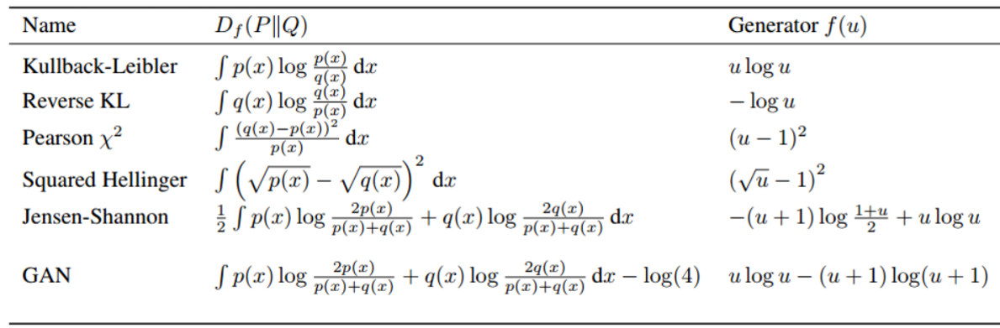

### Variational Estimation
Every convex, lower-semicontinuous function f has a convex conjugate function f*, 

We can also represent f as,

Leverage the above variational representation of f in the definition of f-divergence to obtain a lower bound on the divergence,

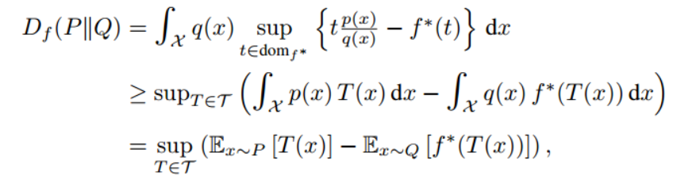

the bound is tight for 

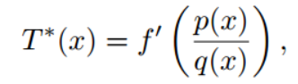

### Variational Divergence Minimization
We can use the variational lower bound on the f-divergence D_f(D|Q) in order to estimate a generative model Q given a true distribution P. 
- Q is our generative model
- T is our variational function
- We can learn a generative model Q(θ) by finding a saddle-point of the following f-GAN objective function, where we minimize with respect to θ and maximize with respect to w.

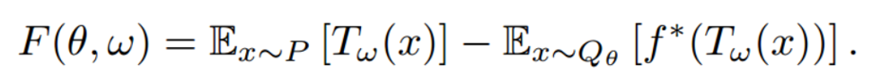

some example

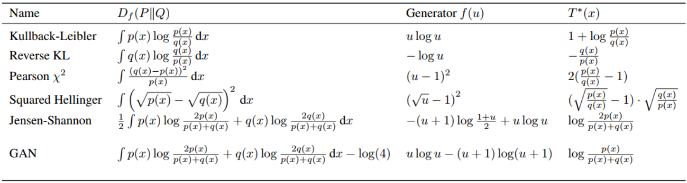

### Algorithms for VDM
Numerical methods to find saddle points, alternating method:

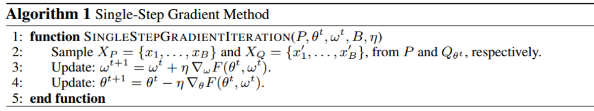

single-step optimization procedure: Algorithm 1 geometrically converges to a saddle point (θ∗, w∗) if there is a neighborhood around the saddle point in which F is strongly convex in θ and strongly concave in w

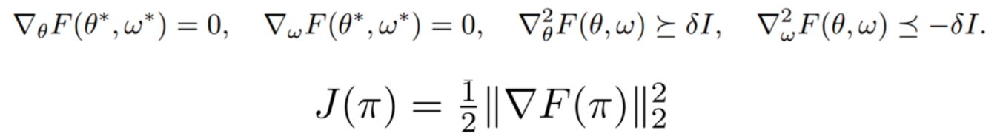

### Experiments

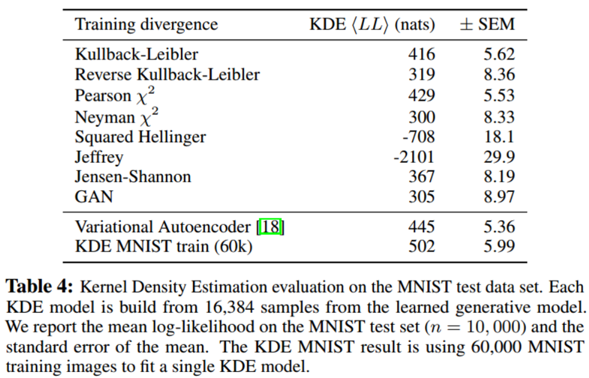

## Conditional Generative Adversarial Nets
### Main idea
The authors introduce the conditional version of generative adversarial nets, which can be constructed by simply feeding the data like y, wishing to condition on to both the generator and discriminator.

### Motivation
(1) In an unconditional generative model, there is no control on modes of data being generated, which results in uncontrollable state for larger imgaes with more pixels.
(2) However, by conditioning the model on additional information it is possible to direct the data generation process. Such conditioning could be based on class labels, on some part of data for inpainting, or even data from different modality.

### CGAN
We perform the conditioning by feeding y into the both the discriminator and generator as additional input layer, where y could be any kind of auxiliary information, such as class labels or data from other modalities

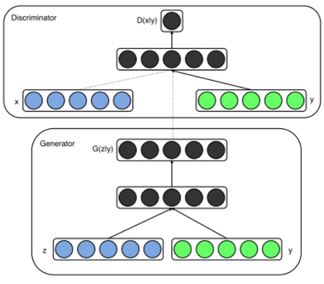

Two-player min-max game:

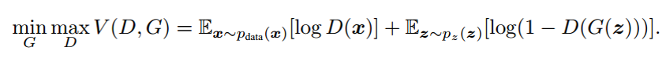

Two-player min-max game with conditional probability:

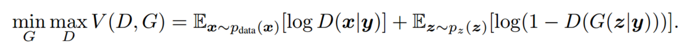

### Experiments

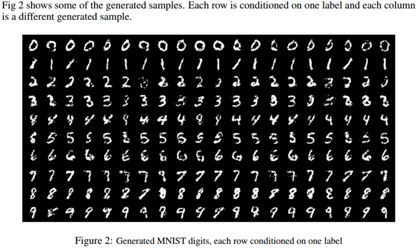

## InfoGAN: Interpretable Representation Learning by Information Maximizing Generative Adversarial Nets

### Main idea
The authors describes InfoGAN, an information-theoretic extension to the Generative Adversarial Network that is able to learn disentangled representations by maximizing the mutual information between a small subset of the latent variables c and the observation G(z,c).

### Mutual Information
(1) Decompose the input noise vector into two parts:(i)z, which is treated as source of incompressible noise;(ii)c, which we will call the latent code and target the salient structured semantic features of the data distribution.

(2) To make latent code c correspond to semantic features, the authors propose an information-theoretic regularization: there should be high mutual information between latent code c and generator distribution G(z,c).

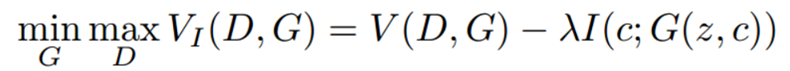

### Variational Mutual Information Maximization
The posterior P(c|x) of I(c;G(z,c)) is unaccessible, we can obtain a lower bound of it by defining an auxiliary distribution Q(c|x) to approximate P(c|x)

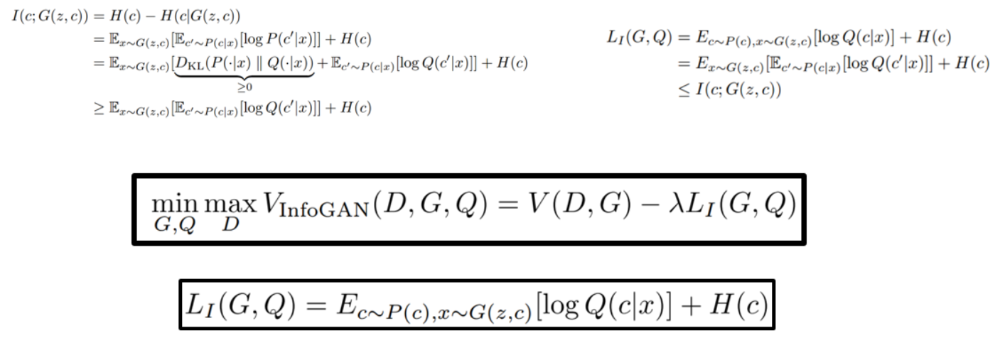

### Architecture
The author parametrize the auxiliary distribution Q as a neural network, which shares all convolutional layers with D. There is one final fully connected layer to output parameters for the conditional distribution Q(c|x), just like a classfier.

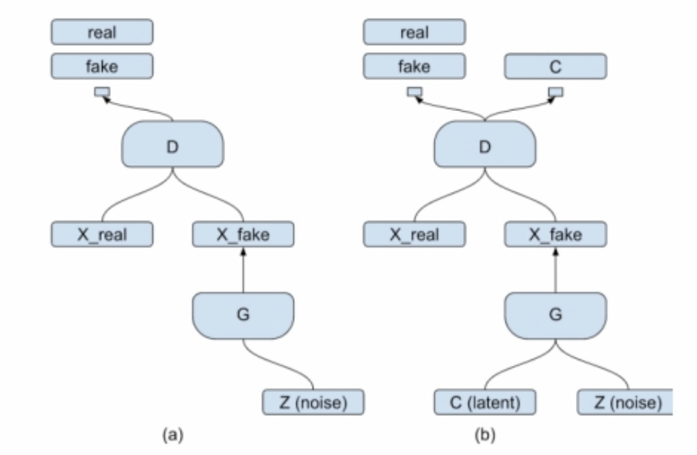

### Experiments

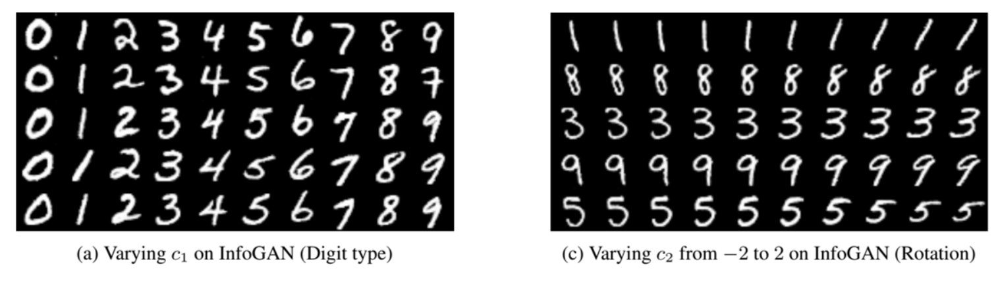

## ENERGY-BASED GENERATIVE ADVERSARIAL NETWORKS
### Main idea
1. The authors introduce the “Energy-based Generative Adversarial Network” model(EBGAN) which views the discriminator as an energy function that attributes low energies to the regions near the data manifold and higher energies to other regions.
2. Viewing the discriminator as an energy function allows to use a wide variety of architectures and loss functions in addition to the usual binary classifier with logistic output.
3. The authors show one instantiation of EBGAN framework as using an auto-encoder architecture, with the energy being the reconstruction error, which exhibits more stable behavior than regular GANs during training.

### EBGAN
Given a positive margin m, a data sample x and a generated sample G(z), the discriminator loss L_D and the generator loss L_G are formally defined by:

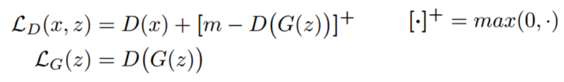

the discriminator D to minimize the quantity V and the generator G to minimize the quantity U

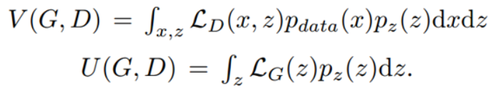

(1) If (D∗; G∗) is a Nash equilibrium of the system, then p(G∗) = p(data) almost everywhere, and V (D∗; G∗) = m.

(2) A Nash equilibrium of this system exists and is characterized by (a) p(G∗) = p(data) (almost everywhere) and (b) there exists a constant γ in [0,m] such that D∗(x) = γ (almost everywhere)

### EBGAN USING AUTO-ENCODERS
In authors’ experiments, the discriminator D is structured as an auto-encoder:

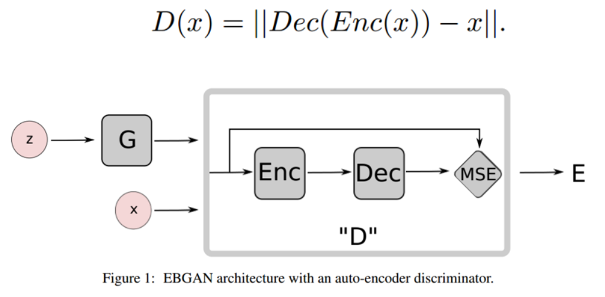

1. The reconstruction-based output offers a diverse targets for the discriminator likely produce very different gradient directions within the minibatch
2. Auto-encoders have traditionally been used to represent energy-based model and arise naturally, which contributes to discovering the data manifold by itself.
3. To avoid identity mapping, implement the repelling regularizer involves a PT that runs at a representation level.
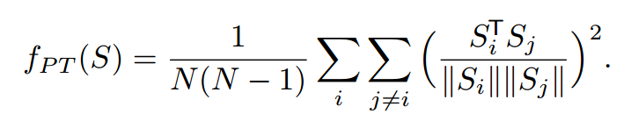

## BEGAN: Boundary Equilibrium GenerativeAdversarial Networks

### Main idea
(1) The authors propose a new equilibrium enforcing method paired with a loss derived from the Wasserstein distance for training auto-encoder based Generative Adversarial Networks. 

(2) BEGAN provides a new approximate convergence measure and a way of controlling the trade-off between image diversity and visual quality.

### Auto-encoders loss
While typical GANs try to match data distributions directly, the authors aims to match auto-encoder loss distributions using a loss derived from the Wasserstein distance.

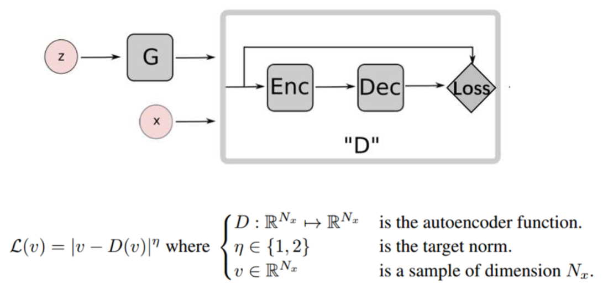

### Wasserstein distance lower bound
Let µ1,µ2 be two distributions of auto-encoder losses, and let m1,m2 be their respective means. The Wasserstein distance can be expressed as:

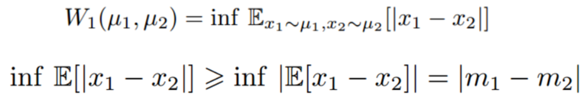

design the discriminator to maximize |m1-m2|: 

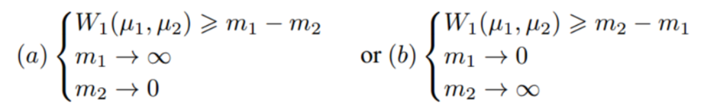

The authors select solution (b) for the objective since minimizing m1 leads naturally to auto-encoding the real images.

### GAN objective
Given the discriminator and generator parameters θ(D) and θ(G), each updated by minimizing the losses L(D) and L(G), we express the problem as the GAN objective, where z(D) and z(G) are samples from z:

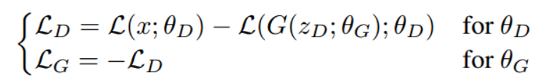

### Equilibrium
1. In practice it is crucial to maintain a balance between the generator and discriminator losses.

2. If we generate samples that cannot be distinguished by the discriminator from real ones, the distribution of their errors should be the same, including their expected error. 
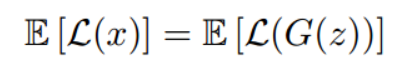

3. We can relax the equilibrium with the introduction of a new hyper-parameter γ~[0,1] defined as:

4. The γ term lets us balance discriminating real from generated images and auto-encoding real images. Lower values of γ lead to lower image diversity and γ is refered as the diversity ratio.

5. Lower values of γ lead to lower image diversity because the discriminator focuses more heavily on auto-encoding real images.
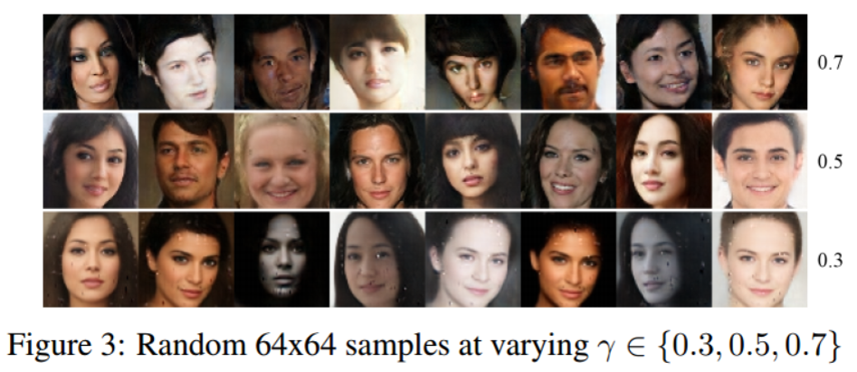

### Boundary Equilibrium GAN
Using Proportional Control Theory to maintain the equilibrium, the BEGAN objective is: 

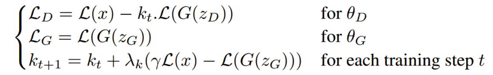

This is implemented using a variable k~[0,1] to control how much emphasis is put on L(G(z)) during gradient descent.

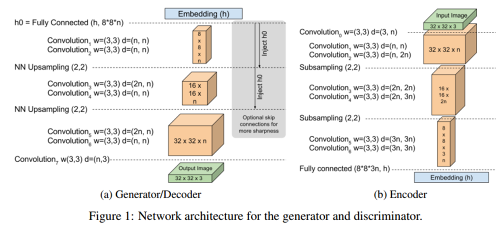

###  Convergence measure

The authors derive a global measure of convergence by using the equilibrium concept: we can frame the convergence process as finding the closest reconstruction L(x) with the lowest absolute value of the instantaneous process error for the proportion control algorithm |γL(x)−L(G(z))|.

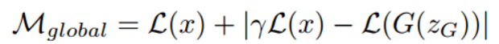

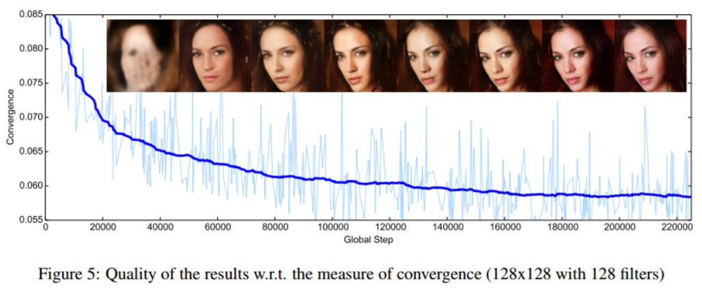

## Wasserstein GAN
### Main idea
(1) The author propose Wasserstein-GAN that minimizes a reasonable and efficient approximation of the EM distance, and theoretically show that the corresponding optimization problem is sound.

(2) In particular, training WGANs gets rid of maintaining a careful balabce in training of the discriminator and the generator, designing network architecture carefully and mode dropping phenomenon. 

(3) One of the most compelling practical benefits of WGANs is the ability to continuously estimate of the EM distance by training the discriminator to optimality. Plotting these learning curves is not only useful for debugging and hyperparameter searches, but also correlate remarkly well with the observed sample quality.

### analysis
(1) For original GAN, the no.1 loss function of Generator encounters gradient vanishing problem.
Generator loss function no.1

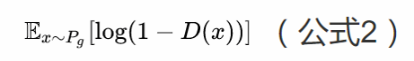

Optimal discriminator

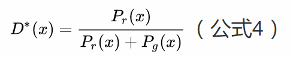

Optimal generator is to minimum

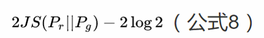

When the dircriminator is good enough that two distributions are likely have no intersection or non-negligible intersection, causing that JS divergence is fixed as a constant log2 and does not provide a usable gradient. On the other hand, KL,JS and TV distances are not sensible cost function when learning distributions supported by low dimensional manifolds.

(2) For original GAN, the no.2 loss function of Generator, which minimizes an unbalanced optimization objective, encounters such problems as unstable gradient and mode collapse.
Generator loss function no.2

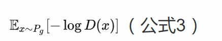

Optimal discriminator

Optimal generator is to minimum

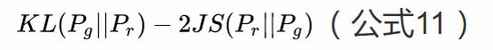

First, the generator minimizes the KL divergence of Pg and Pr, meanwhile maximizes the JS divergence of them, which leads to gradient instability numerically. Second, the KL divergence is asymmetrical, with severe punishment in not generating real samples and light punishment in generating unreal samples, which results in that the generator tends to generate reduplicate but safe samples ignoring diversity.

### Wasserstein distance
The Earth-Mover(EM) distance or Wasserstein-1 always reflecting distances 

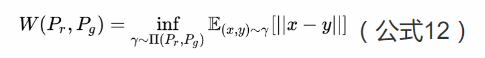

Comparison:

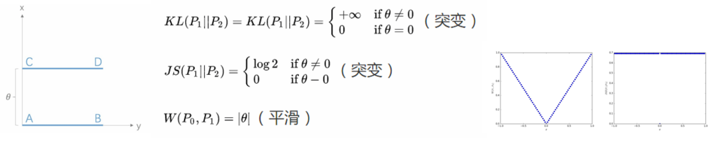

### Wasserstein GAN
W(Pr, Pθ) have nicer properties than JS,KL…, to avoid intractable joint distributions, we choose a transformation using Lipschitz continuation:

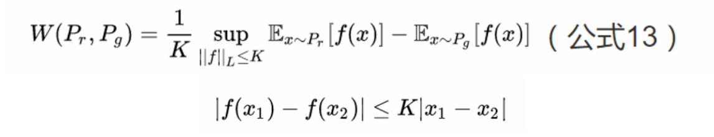

Lipschitz condition limits the maximum local variation of a continuous function, which means that K*W is the supremum over all the K-Lipschitz functions with constant ||f||_L not exceeding K. Particularly, we define a NN parameterized with w to represent K-Lipschitz functions:

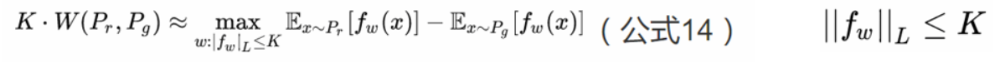

We clamp the weights to a fixed box after each gradient update to satisfy K-Lipschitz condition.

Discriminator:

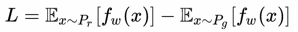

The discriminator maximizes above formula to approximatively get Wasserstein distance between Pr and Pg 

Generator:

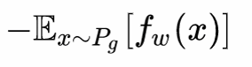

The generator approximatively minimizes the Wasserstein distance with more reliable gradient.

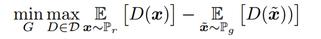

### Training

1. Throw out the sigmoid function in the last layer of the generator, because approximating Wasserstein distance is the regression task instead of classification task.

2. The loss of generator and discriminator does not take log

3. Clamp the weights to a fixed box after each gradient update 

4. Recommend RMSProp or SGD as optimization algorithms, as the loss is nonstationary for high learning rate.

### Experiments

## Improved Training of Wasserstein GANs
### Main idea
(1) The authors find that WGANs still generate low-quality samples or fail to convergence due to the use of weight clipping in WGAN to enforce a Lipschitz constraint on the critic, which can lead to pathological behavior.

(2) The authors propose an alternative method for enforcing the Lipschitz constraint: instead of clipping weights, penalize the norm of the gradient of the critic with respect to its input.

### Difficulties of WGAN
1. Capacity underuse: under a weight-clipping constraint, most neural network architectures can only attain their maximum gradient norm of k, making the critic learns extremely simple functions

2. Exploding and vanishing gradients: depend on the value of the clipping threshold c. 

### WGAN-GP
Exactly enforcing the constraint is not easily tractable, so instead we enforce a soft version: at certain points sampled from a distribution over the input space x’~ P(x’), we evaluate the gradient of the critic ∇x’D(x’) and penalize its squared distance from 1 in the critic loss function.

algorithm

experimrnts

## Loss-Sensitive Generative Adversarial Networkson Lipschitz Densities
### Main idea
(1) The authors propose a novel Loss-Sensitive GAN(LS-GAN) that learns a loss function to distinguish real and generated samples by the assumption that a real example should have a smaller loss than a generated sample.

(2) The authors present a regularity condition on the underlying data density, which allows us to use a class of Lipschitz losses and generators to model the LS-GAN.

(3) The authors derive a non-parametric solution that characterizes the upper and lower bounds of the losses learned by the LS-GAN, both of which are piecewise linear and have non-vanishing gradient almost everywhere.

### Motivation
1. A dyadic treatment of real and generated data as positive and negative examples may oversimplify the problem of learning a GAN model.

2. Assuming the GAN has infinite modeling causes vanishing gradient and severe overfitting problem.

3. A large family of real-world distributions, where the data density does not change abruptly over points that are close to one another, satisfy Lipschitz densities.

### Loss-Sensitive GAN
1. The loss of a real sample should be smaller than that of a generated counterpart by an unfixed margin that depends on how close they are to each other in metric space.

2. Relax the above hard constraint by introducing a slack variable

- The first term minimizes the expected loss function over data distribution since a smaller value of loss function is preferred on real samples. 
- The second term is the expected error caused by the violation of the constraint.

3. minimize game

4. As λ->+∞, the density distribution P(G∗) of the samples generated by G(φ∗) will converge to the underlying data density P(data)

### Algorithm

Non-parametric solutions to the optimal loss function by minimizing (8) over the whole class of Lipschitz loss functions. 

## Are GANs Created Equal? A Large-Scale Study
### Main idea
(1) The authors provide a fair and comprehensive comparison of the state-of-the-art GANs, and empirically demonstrate that nearly all of them can reach similar values of FID, given a high enough computational budget.

(2) The authors adopt such metrics as inception score(IS), frechet inception distance(FID), precision and recall, and also verify the robustness of these models in a large-scale empirical evaluation

### Motivation
There is no clear consensus on which GAN algorithm(s) perform objectively better than the others, partially due to the lack of robust and consistent metric, as well as limited comparisons which put all algorithms on equal footage, including the computational budget to search over all hyperparameters.

The main issue with evaluation stems is untraceably computing the probability Pg(x). As a remedy, two evaluation metrics were proposed to quantitatively assess the performance of GANs: Inception Score(IS) and Frechet Inception Distance(FID)

### Flavors of GAN

### Metrics
(1) FID has some properties, such as robustness to noise, dectecting mode dropping and sensitive to encoding network.

(2) FID and IS are incapable of detecting overfitting: a memory GAN which simply stores all training samples would score perfectly under both measures.

(3) We propose an approximation to precision and recall for GANs and it can be used to quantify the degree of overfitting, which should be viewed as complementary to IS or FID.

(4) Computing the distance to the manifold: The problem of evaluating the quality of the generative model can be effectively transformed into a problem of computing the distance to the manifold.

### Large-scale Experimental Evaluation

We observe that, given a relatively low budget (say less than 15 hyperparameter settings), all models achieve a similar minimum FID. Furthermore, for a fixed FID, “bad” models can outperform “good” models given enough computational budget.

We argue that the computational budget to search over hyperparameters is an important aspect of the comparison between algorithms.

 We observe that GAN training is extremely sensitive to hyperparameter settings and there is no model which is significantly more stable than others.

# Networks
## Deep Generative Image Models using a Laplacian Pyramid of Adversarial Networks

### Main idea
The authors introduce a generative parametric model capable of producing high quality samples of natural images, using a cascade of convolutional networks within Laplacian pyramid framework(LPGAN) to generate images in a coarse-to-fine fashion.

### Laplacian Pyramid
The Laplacian pyramid is a linear invertible image representation consisting of a set of band-pass images, spaced an octave apart, plus a low-frequency residual. I(0) = I and I(k) is k repeated applications of downsampling.

Starting at the coarsest level, we repeatedly upsample and add the difference image h at the next finer level until we get back to the full resolution image.

### LAPGAN
In the reconstruction procedure, a set of conditional generative convet models {G0,…,Gk}, each of which captures the distribution of coefficients h_k for natural images at a different level of the Laplacian pyramid.

In the training procedure, G(k) is a convnet which uses a coarse scale version of the image l(k) = u(I(k+1)) as an input, as well as noise vector z(k). D(k) takes as input h(k) or h’(k), along with the low-pass image l(k), and predicts if the image was real or generated. 

### Thinking
(1) Breaking the generation into successive refinements is the key idea in this work.
(2) The authors never make any attempt to train a network to discriminate between the output of a cascade and a real image and instead focus on making each step plausible.
(3) The independent training of each pyramid level has the advantage that it is far more difficult for the model to memorize training examples – a hazard when high capacity deep networks are used.

## Unsupervised Representation Learning with Deep Convolutional Generative Adversarial

### Main idea
(1) The authors propose and evaluate a set of constraints on the architectural topology of convolutional GANs, named DCGAN, making them stable to train in most datasets.
(2) The authors visualize the filters learnt by GANs and empirically show that specific filters have learned to draw specific obejects.
(3) The authors show that the generators have interesting vector arithmetic properties allowing for easy manipulation of many semantic qualities of generated samples.

### Architecture
1. All convolutional net replaces deterministic spatial pooling functions (such as maxpooling).
Discriminator: strided convolutions

Generator: fractional strided convolutions

2. Remove fully connected hidden layers for deeper architectures.

3. Use batchnorm in both the generator and the discriminator, which helps deal with training problems that arise due to poor initialization and helps gradient flow in deeper models

4. Use ReLU activation in generator for all layers except for the output which uses Tanh and Use LeakyReLU activation in the discriminator for all layers

### Experiments
(1) Validation of DCGAN capabilities using GANs as a feature extractor

(2) Walking in the latent space(z) results in semantic changes

(3) Using guided backpropagation to visualize the features learnt by discriminator

(4) Remove certain objects by dropping out relevant feature activations

(5) Perform vector arithmetic on the Z vectors to evaluate learned representation space

## Improved Techniques for Training GANs
### Main idea
The authors present a variety of new architectural features and training procedures for GANs framework, which help greatly in semi-supervised classification and the generation of images that humans find visually realistic. 

### Feature Matching
Instead of directly maximizing the output of the discriminator, the new objective requires the generator to generate data that matches the statistics of the real data, where we use the discriminator only to specify the statistics that we think are worth matching. Specifically, we train the generator to match the expected value of the features on an intermediate layer of the discriminator. 

### Minibatch Discrimination
Discriminator model that looks at multiple examples in combination, rather than in isolation, could potentially help avoid collapse of the generator. Modelling the closeness between examples in a minibatch is as follows:

### Historical averaging
modify each player’s cost to include a term:

where θ[i] is the value of the parameters at past time i. This approach was able to find equilibria of low-dimensional, continuous non-convex games and some specific cases.

### One-sided label smoothing
Replacing the 0 and 1 targets for a classifier with smoothed values, like 0.9 or 0.1, is shown to reduce the vulnerability of neural networks to adversarial examples. Replacing positive classification targets with α and negative targets with β:

smooth only the positive labels to α, leaving negative labels set to 0. 

### Virtual batch normalization
(1) Batch normalization causes the output of a neural network for an input example x to be highly dependent on several other inputs x’ in the same minibatch. 

(2) To avoid this problem we introduce virtual batch normalization (VBN), in which each example x is normalized based on the statistics collected on a reference batch of examples that are chosen once and fixed at the start of training, and on x itself. 

### Assessment of image quality
1. One intuitive metric of performance can be obtained by having human annotators judge the visual quality of samples, but the metric varies depending on the setup of the task and the motivation of the annotators

2. An automatic method to evaluate samples: images that contain meaningful objects should have a conditional label distribution p(y|x) with low entropy. Moreover, we expect the model to generate varied images, so the marginal ∫ p(y|x = G(z)) 𝑑𝑧  should have high entropy.

### Semi-supervised learning
We can do semi-supervised learning with any standard classifier by simply adding samples from the GAN generator G to our data set, labeling them with a new “generated” class y = K + 1.

## Generative Image Modeling using Style andStructure Adversarial Networks
### Main idea
The authors factorize the image generation process and propose Style and Structure Generative Adversarial Network (S2-GAN) consisting of two components: 
- the Structure-GAN generates a surface normal map; 
- the Style-GAN takes the surface normal map as input and generates the 2D image. 

### Structure-GAN
We train a Structure-GAN using the ground truth surface normal from Kinect. Because the perspective distortion of texture is more directly related to normals than to depth, we use surface normal to represent image structure in this paper. 

### Style-GAN
Given the RGB images and surface normal maps from Kinect, we modify our generator network to a conditional GAN. The surface normal maps are given as additional inputs for both the generator G and the discriminator D, which enforces the generated image to match the surface normal map.

### Style-GAN with Pixel-wise Constraints
We make the following assumption: if the generated image is real enough, it can be used for reconstructing the surface normal maps. Thus, we propose to add a pixel-wise constraint to explicitly guide the generator to align the outputs with the input surface normal maps.

We train Fully Convolutional Network(FCN) wieh classification for surface normal estimation, using the RGBD data which provides indoor scene images and ground truth surface normals.

### Joint Learning for S2-GAN
After training the Structure-GAN and Style-GAN independently, we merge all networks and train them jointly with removing the FCN constraint.

### Experiments

## Pose Guided Person Image Generation
### Main idea
The authors propose the novel Pose Guided Person Generation network(PG2), which utilizes the pose information explicitly and consists of two key stages: pose integration and image refinement.

### Architecture

### Stage-I:Pose integration
Generator G1: a U-Net-like architecture convolutional autoencoder with skip connections.

- Stacked convolutional layers integrate the information of I(a) and P(b) and transfer information to neighboring body parts.
- A fully connected layer is used such that information between distant body parts can exchange information.
- Skip connections between encoder and decoder help propagate image information directly from input to output.

Pose mask loss: we adopt L1 loss between generation and target images with a pose mask MB, which alleviates the influence of background from the condition image.

The output of G1 is blurry because the L1 loss encourages the result to be an average of all possible cases. However, G1 does capture the global structural information specified by the target pose, as well as other low-frequency information such as the color of clothes. 

### Stage-II:Image refinement
Generator G2: G2 aims to generate an appearance difference map between initial result I’(b) and target I(b), with I’(b) and I(a) as input.

The use of difference maps speeds up the convergence of model training since the model focuses on learning the missing appearance details.

The fully-connected layer is removed from   the U-Net which helps to preserve more details from the input because a fully-connected layer compresses a lot of information contained in the input.

### Stage-III: Discriminator
Discriminator D: D to recognize the pairs’ fakery (I’(b2),I(a)) vs (I(b),I(a)), which encourages D to learn the distinction between I’(b2) and I(b) instead of only the distinction between synthesized and natural images.

- Without pairwise input, we worry that G2 will be mislead to directly output I(a) which is natural by itself instead of refining the coarse result of the first stage I’(b1).
- When λ is small, the adversarial loss dominates the training and it is more likely to generate artifacts; when λ is big, the generator with a basic L1 loss dominates the training, making the whole model generate blurry results.

## Learning from Simulated and Unsupervised Images through Adversarial Training
### Main idea
1. To reduce the gap between synthetic and real image distributions, the authors propose Simulated+Unsupervised (S+U) learning, where the task is to learn a model to improve the realism of a simulator’s output using unlabeled real data, while preserving the annotation information from the simulator.

2. The authors make several key modifications to the standard GAN algorithm to preserve annotations, avoid artifacts, and stabilize training: (i) a ‘self-regularization’ term, (ii) a local adversarial loss, and (iii) updating the discriminator using a history of refined images. 

### Architecture
The key requirement for S+U learning is that the refined image x’ should look like a real image in appearance while preserving the annotation information from the simulator.

### Adversarial Loss with Self-Regularization
To add realism, we train our refiner network using an adversarial loss. The loss of discriminator network and refiner network are followed:

where D(.) is the probability of the input being a synthetic image, and 1 − D(.) is that of a real one. 

To preserve annotations information of the simulator, we propose using a slef regularization loss that minimizes per-pixel difference between a feature transform of the synthetic and refined images.

where ψ is the mapping from image space to a feature space, and |.|1 is the L1 norm. The feature transform can be an identity map, image derivatives, mean of color channels, or a learned transformation such as a convolutional neural network

The overall refiner loss function: 

### Local adversarial loss
Furthermore, to avoid drifting and introducing spurious artifacts while attempting to fool a single stronger discriminator, we limit the discriminator’s receptive field to local regions, resulting in multiple local adversarial losses per image.
- When we train a single strong discriminator network, the refiner network tends to over-emphasize certain image features to fool the current discriminator network, leading to drifting and producing artifacts.
- Any local patch sampled from the refined image should have similar statistics to a real image patch.
- This division not only limits the receptive field, and hence the capacity of the discriminator network, but also provides many samples per image for learning the discriminator network.

### perceptual loss
By minimizing the perceptual adversarial loss function LT with respect to parameters of T, we will encourage the network T to generate image T(x) that has similar high-level features with its ground-truth y. 

If the sum of discrepancy between the current learned representations of transformed image T(x) and ground-truth image y is less than the positive margin m, the loss function LD will upgrade the discriminative network D for new high-dimensional spaces, which discover the discrepancy that still exist between the transformed images and corresponding ground-truth. 

### Loss function
Given a pair of data (x, y) ∈ (X(input), Y(ground-truth)), the loss function of image transformation network J(T) and the loss function of discriminative network J(D) are formally defined as:

# Image translation
## Coupled Generative Adversarial Networks
### Main idea
(1) The authors propose coupled generative adversarial network(CoGAN) for learning a joint distribution of multi-domain images, with just samples drawn from the marginal distributions.

(2) CoGAN is achieved by enforcing a weight-sharing constraint that limits the network capacity and favors a joint distribution solution over a product of marginal distributions one.

### Architecture

### Models
Generative Models

1. The first few layers that decode high-level semantics share the weights, forcing the high-level semantics to be decoded in the same way.

2. The last few layers that decode low-level semantics map the shared representation to images in individual domains for confusing the respective discriminative models.

Discriminative Models

1. The weight-sharing constraint in the discriminative helps reduce the total number of parameters in the network, but it is not essential for learning a joint distribution

### Learning
The CoGAN framework corresponds to a constrained minmax game given by

## Image-to-image translation using conditional adversarial nets
### Main idea
The authors investigate conditional adversarial networks, called pix2pix, as a general-purpose solution to image-to-image translation problems. 

These networks not only learn the mapping from
input image to output image, but also learn a loss function to train this mapping, which makes it possible to apply the same generic approach to problems that traditionally would require very different loss formulations.

### Objective

Without z, the net could still learn a mapping from x to y, but would produce deterministic outputs, and therefore fail to match any distribution other than a delta function. 

But in experiments, we found that the generator simply learned to ignore the noise and dropout produce only minor stochasticity in generated images.

## StarGAN: Unified Generative Adversarial Networks for Multi-Domain Image-to-Image Translation
### Main idea
(1) The authors propose StarGAN, a novel and scalable approach that can perform image-to-image translations for multiple domains using only a single model.

(2) Such a unified model architecture of StarGAN allows simultaneous training of multiple datasets with different domains within a single network, which leads to StarGAN’s superior quality of translated images as well as the flexibility  of translating an input image to any desired target domain.

### Motivation
Existing models in multi-domain image translation tasks are both inefficient and ineffective.

- inefficiency: in order to learn all mappings among k domains, k(k−1) generators have to be trained.

- ineffective: there exist global features that can be learned from images of all domains such as face shapes, each generator cannot fully utilize the entire training data and only can learn from two domains out of k. 

- they are incapable of jointly training domains from different datasets because each dataset is partially labeled

### Overview

### Loss function
Adversarial Loss:

Where G generates an image G(x;c) conditioned on both the input image x and the target domain label c, while D tries to distinguish between real and fake images. 

Domain Classification Loss:

Where a domain classification loss of real images used to optimize D, and a domain classification loss of fake images used to optimize G. 

Reconstruction Loss:

where G takes in the translated image G(x; c) and the original domain label c’ as input and tries to reconstruct the original image x. That is to preserve the content of its input images while changing only the domain-related part of the inputs.

Full Objective:

where λ(cls) and λ(rec) are hyper-parameters that control the relative importance of domain classification and reconstruction losses, respectively, compared to the adversarial loss.

### Training with Multiple Datasets
Mask Vector:

we introduce a mask vector m that allows StarGAN to ignore unspecified labels and focus on the explicitly known label provided by a particular dataset.

where [·] refers to concatenation, and c(i) represents a vector for the labels of the i-th dataset, and m represents an n-dimensional one-hot vector, with n being the number of datasets.

Training Strategy: we train the model in a multi-task learning setting, where the discriminator tries to minimize only the classification error associated to the known label, using mask vector.

# Face Generative and Editing
## Learning Residual Images for Face Attribute Manipulation
### Main idea
1. The authors address face attribute manipulation by learning the corresponding residual image which is defined as the difference between images after and before the manipulation.
2. The framework, based on the Generative Adversarial Network and VAEs, consists of two image transformation networks and a shared discriminative network, where model two inverse manipulation with dual learning.

### Architecture

### Loss function for G

1. To make the residual image be sparse, apply an L-1 norm regularization in G.

2. To encourage the transformed image to have similar content to the input face image, apply perceptual loss in D

3. Image transformation

4. Dual Learning

### Loss function for D

Given the real images x(0) and x(1) with known attribute label 0 and label 1, we regard the transformed images x’(0) and x’(1) as an extra category with label 2.

where t is the label of the image and p(t) is the softmax probability of the t-th label.

### Experiments
Experiments show that the learned residual images successfully simulate the manipulations and the generated images retain most of the details in attribute-irrelevant areas.

## Age Progression/Regression by Conditional Adversarial Autoencoder
### Main idea
(1) The authors propose a conditional adversarial autoencoder (CAAE) that learns a face manifold, traversing on which smooth age progression and regression can be realized simultaneously. 

(2) In CAAE, the face is first mapped to a latent vector through a convolutional encoder, and then the vector is projected to the face manifold conditional on age through a deconvolutional generator.

(3) The generative model can directly produce the image with desired age attribute, given an unlabeled image without paired samples in training.

The latent vector preserves personalized face features (i.e., personality) and the age condition controling progression vs. regression. 

### CAAE

1. Autoencoder E(x)=z: the ouput z preserves the high-level personal feature of the input face x.

2. Generator G(z,l)=z^: the output face conditioned on certain age and specific personality(z). 

3. D(z) regularizes z to be uniform distributed, smoothing the age transformation.
  - Using uniform distribution as the prior forces z to evenly populate the latent space with no apparent “holes”.
  - Exhibition of the “hole” indicates that face images generated by interpolating between arbitrary z’s may not lie on the face manifold

4. D(img) based on age and human face forces G to generate photo-realistic and plausible faces for arbitrary z and l. 
 - The pixel-wise loss could only make the framework generate a face close to the trained ones in a manner of interpolation, causing the generated face to be very blurred. 
 - The D(img) will discriminate the generated faces from real ones in aspects of reality, age, resolution.

### Objective Function

### Experiments

## Disentangled Representation Learning GAN for Pose-Invariant Face Recognition
### Main idea
(1) The authors proposes Disentangled Representation Learning-Generative Adversarial Network (DR-GAN) with three distinct novelties:

(2) The encoder-decoder structure of the generator allows DR-GAN to learn the identity representation for each face image, in addition to image synthesis.

(3) This representation is explicitly disentangled from other face variations such as pose, through the pose code provided to the decoder and pose estimation in the discriminator.

(4) DRGAN can take one or multiple images as the input, and generate one integrated representation along with an arbitrary number of synthetic images.

### Architecture

For any face image x with label y = {y(d), y(p)}, where y(d) represents the label for identity and y(p) for pose, we are interested in generating a new face image x’ with the same identity y(d) but a different pose controlled by a pose code c. 

### Single-Image DR-GAN
D consists of two parts: D = [D(d), D(p)].

- D(d) is used for identity classification with N(d) representing the total number of identities in the training set and the additional dimension is for fake/real classification. 

- D(p) is used for pose classification with N(p) denoting the total number of poses.  

G consists of G(enc) and G(dec).

- G(enc) aims for identity representation learning from a face image x:

- G(dec) aims to synthesize a face image x’ with identity y(d) and a target pose specified by c, and z is the noise used to model variance other than identity and pose. 

### Multi-Image DR-GAN
Multi-Image DR-GAN has the same D as single-image DR-GAN, but different G. Beside extracting features f(x), G(enc) add one more convolution channel to estimate a confident coefficient ω, which predicts the quality of the learnt representation.

the fused representation:

The generated image is expected to share the same identity with all input images. Thus, the objective function for learning G has a total of 2(n + 1) terms to maximize:

To mimic the variation in the number of input images, we use a simple but effective trick: applying drop-out on the coefficient ω. Hence, during training, the network can take any number of inputs from 1 to n.

### Experiments

## Tag Disentangled Generative Adversarial Networks for Object Image Re-rendering
### Main idea
The authors propose a principled Tag Disentangled Generative Adversarial Networks(TD-GAN), which consist of a disentangling network, a generative network, a tag mapping net and a discriminative network, for re-rendering new images for the object from a single image based on specific multiple scene properties.

### Motivation
Despite the great progress achieved in image re-rendering, one worrying shortage is regarding the effectiveness and independence of the (disentangled) representations extracted from the input image. 

For most existing methods, (disentangled) representations are mostly extracted from images themselves, and the valuable tag information (e.g., photograph conditions and object characterizations) associated with images has not been finely explored. 

There was little attempt to make the re-rendering result more realistic by increasing the difficulty in distinguishing genuine and re-rendered images.

### Architecture

### Consistency between images and tags
Exploring consistency between the image and its tags. The image and its tags consistently represent the same object, despite the difference in physical properties, respectively a visual approach and a textual or parametric way.

- the disentangling network R aims to extract the disentangled representations R(x) of the input image x.
- the tag mapping net g aims to obtain the disentangled representations g(C) of the tags.
- the first objective of TD-GAN is to penalize the discrepancy between the disentangled representations R(x) and g(C) generated from the image and its tags. 

### rendering
To maximize the rendering capability of network G, we tend to minimize the discrepancy between genuine images and rendered images.

To provide a strong driving force for continuously improving the re-rendering performance, we introduce the discriminative network D into TD-GAN.

### Training Process
TD-GAN is composed of R, D, G and g, which can be optimized and learned using the alternating optimization strategy.

# Image Inpainting

## Semantic Image Inpainting with Deep Gnerative Models

### Main idea
The authors propose a novel method for semantic image inpainting, which generates the missing content by conditioning on the available data.

Given a trained generative model, the authors search for the closest encoding of the corrupted image in the latent image manifold using the context and prior losses, and pass this encoding through the generative model to infer the missing content.

### Architecture

1 Finding the closest encoding z^

2 Importance Weighted Context Loss

3 Prior Loss penalizes unrealistic images

λ is a parameter to balance between the two losses. Without Lp, the mapping from y to z may converge to a perceptually implausible result.

4 Poisson blending is used to preserve the same intensities of the surrounding pixels. 

The key idea is to keep the gradients of G(z^) to preserve image details while shifting the color to match the color in the input image y.

### Experiments

## Generative Face Completion
### Main idea
The authors propose a algorithm to directly generate contents for missing regions based on a neural network, which consists of a reconstruiction loss, two adversarial losses and a semantic parsing loss.

### Architecture

### Loss
The generator G is designed as an autoencoder to construct new contents given input images with missing regions. And we replace pixels in the non-mask region of the generated image with original pixels.

- the hidden representations obtained from the encoder capture more variations and relationships between unknown and known regions, which are then fed into the decoder for generating contents.
- The generator can be trained to fill the masked region or missing pixels with small reconstruction errors.
- L2 loss penalizes outliers heavily, and the network is encouraged to smooth across various hypotheses to avoid large penalties, which make generated images blurry and smooth.

We adopt a local discriminator and a global discriminator to encourage more photo-realistic results.
- First, the local loss can neither regularize the global structure of a face, nor guarantee the statistical consistency within and outside the masked regions.
- Second, while the generated new pixels are conditioned on their surrounding contexts, a local D can hardly generate a direct impact outside the masked regions during the back propagation.

The parsing network, which is a pretrained model and remains fixed, is to further ensure the new generated contents more photo-realistic and encourage consistency between new and old pixels.

- the GAN model tends to generate independent facial components that are likely not suitable to the original subjects with respect to facial expressions and parts shapes
- the global D is not effective in ensuring the consistency of fine details in the generated image. 
- Both cases indicate that more regularization is needed to encourage the generated faces to have similar high-level distributions with the real faces

loss function

- A reconstruction loss Lr to the generator, which is the L2 distance between the network output and the original image. 
- The local discriminator only provides training signals (loss gradients) for the missing region while the global discriminator back-propagates loss gradients across the entire image
- The loss Lp is the simple pixelwise softmax loss

### Training
The training process is scheduled in three stages by gradually increasing the difficulty level and network scale.

First, we train the network using the reconstruction loss to obtain blurry contents.

Second, we fine-tune the network with the local adversarial loss. 

The global adversarial loss and semantic regularization are incorporated at the last stage.

# Super-Resolution
## Photo-Realistic Single Image Super-Resolution Using a Generative AdversarialNetwork
### Main idea
1. The authors present SRGAN, a generative adversarial network (GAN) for image superresolution (SR) with a perceptual loss function which consists of an adversarial loss and a content loss.

2. The adversarial loss pushes the solution to the natural image manifold, using a discriminator network that is trained to differentiate between the super-resolved images and original photo-realistic images.

3. In addition, the content loss measures perceptual similarity using high-level feature maps of the VGG network, instead of similarity in pixel space. 

### Architecture

### Generator
For training images I(HR), with corresponding I(LR):

I(LR) is obtained by applying a a Gaussian filter to I(HR), followed by a downsampling operation with downsampling factor r

### MSE loss and VGG loss

Minimizing MSE encourages finding pixel-wise averages of plausible solutions which are typically overly-smooth and thus have poor perceptual quality

MSE loss have high peak signal-to-noise ratios, but they are often lacking high-frequency details and are perceptually unsatisfying in the sense that they fail to match the fidelity expected at the higher resolution. 

### Discriminator

### Experiments

SRResNet sets a new state of the art on public benchmark datasets when evaluated with the widely used PSNR measure.

SRGAN reconstructs for large upscaling factors (4×) are, by a considerable margin, more photo-realistic than reconstructions obtained with state-ofthe-art reference methods, Using extensive MOS testing

# 3D
## Learning a Probabilistic Latent Space of Object Shapes via 3D Generative-Adversarial Modeling
### Main idea
The authors propose a novel framework, namely 3D Generative Adversarial Network (3D-GAN), which generates 3D objects from a probabilistic space by leveraging recent advances in volumetric convolutional networks and generative adversarial nets.  

### 3D-GAN

For each batch, the discriminator only gets updated if its accuracy in the last batch is not higher than 80% because the discriminator usually learns much faster than the generator.

### 3D-VAE-GAN

we map a 2D image to the latent representation and recover the 3D object corresponding to that 2D image.

### Experiments

