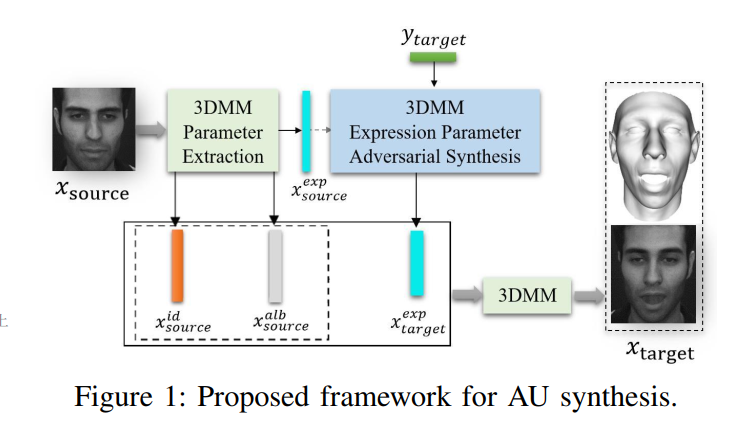
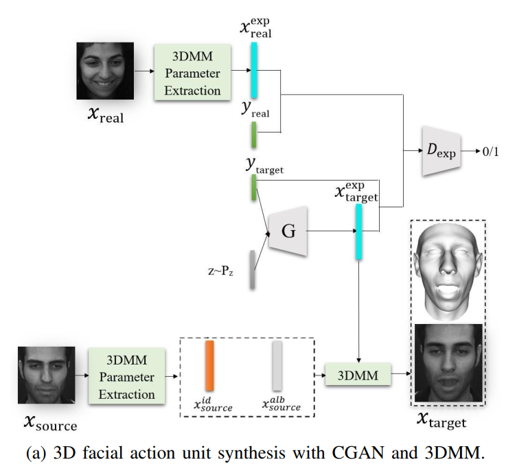
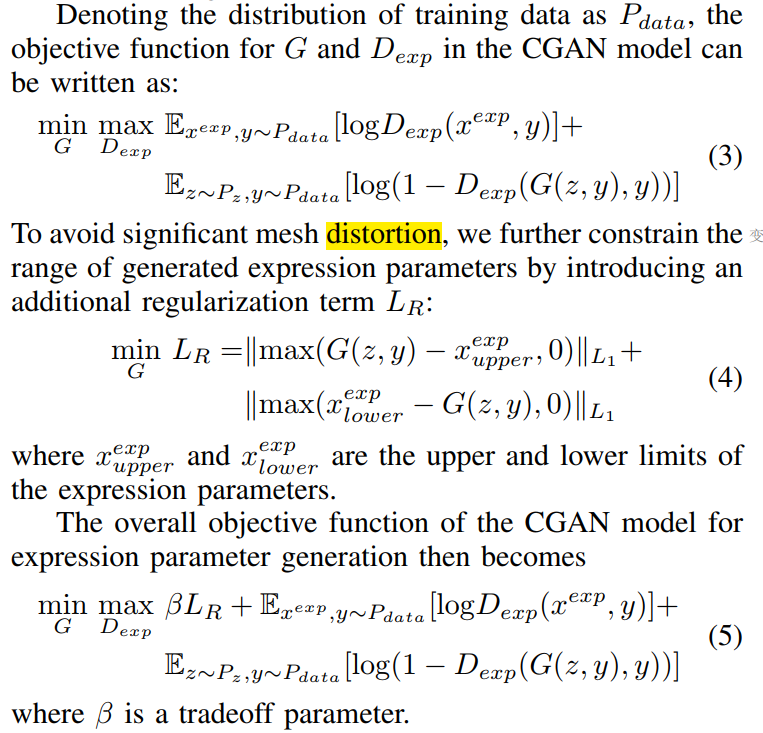
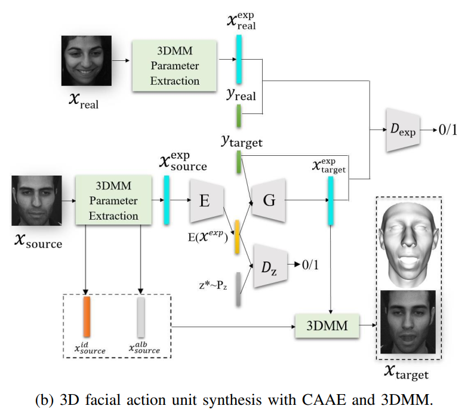
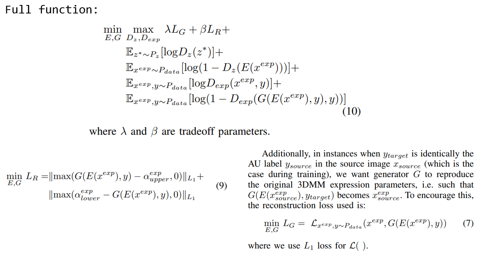
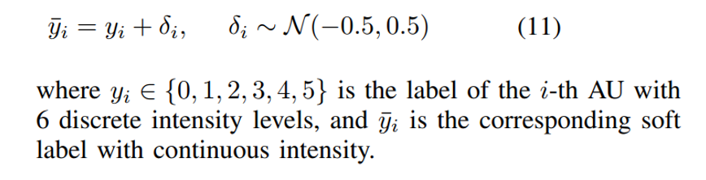

## Conditional Adversarial Synthesis of 3D Facial Action Units
### Abstract
Employing deep learning-based approaches for fine-grained facial expression analysis, such as those involving the estimation of Action Unit (AU) intensities, is difficult due to the lack of a large-scale dataset of real faces with sufficiently diverse AU labels for training. 

In this paper, we consider how AU-level facial image synthesis can be used to substantially augment such a dataset. We propose an AU synthesis framework that combines the well-known 3D Morphable Model (3DMM), which intrinsically disentangles expression parameters from other face attributes, with models that adversarially generate 3DMM expression parameters conditioned on given target AU labels, in contrast to the more conventional approach of generating facial images directly. 

In this way, we are able to synthesize new combinations of expression parameters and facial images from desired AU labels. Extensive quantitative and qualitative results on the benchmark DISFA dataset demonstrate the effectiveness of our method on 3DMM facial expression parameter synthesis and data augmentation for deep learning-based AU intensity estimation.

### Methodology
Generating 3DMM Expression Parameters with CGAN

architecture:

loss function:

Generating 3DMM Expression Parameters with CAAE

It empirically turns out that expression parameters are not fully disentangled from the identity and albedo parameters within the 3DMM, posing a significant problem – unlike AUs which are universal labels, new expression parameters cannot simply be combined with other existing parameters without risk of producing strange artifacts, because certain expression parameters may in fact be incompatible with the identity and albedo parameters. 

architecture:

loss function:

Soft Label Processing

In order to cope with subjective variance in labeling AUs in the training set and the small number of discrete AU intensity levels, a simple but effective soft label processing is introduced by adding a random noise δi to the discrete label yi, which can be expressed as

### Related Work
Expression Editing with Geometric Models:

- Facial expression generation on a new subject using geometric models is often realized by direct expression transfer, which simply replaces the source facial expression parameters with the target ones. However, they cannot realize facial expression editing or synthesis based on high-level semantic descriptions, such as general emotions or precise AU labels. 

- In contrast, our framework can generate the expression parameters of any AU label and synthesize the corresponding facial image.

Expression Editing with Generative Models:

- The generated facial images of all these methods above only focus on facial expression with several general emotions, and the resolutions of the generated images are still not high enough to reflect the local dynamic changes of AUs.

- The resolution of CDAAE's generated facial image is only 32×32, and the generated facial images with AU labels are not well quantitatively evaluated.

- In addition, all these existing generative model based approaches require large training database to implicitly disentangle and manipulate those discriminative expression descriptions apart from other facial attributes over facial images.

- In contrast, we combine the geometry model of 3DMM, which inherently disentangle expression parameters from other facial attributes, with the generative model by adversarially generating the 3DMM expression parameters conditioned on the target AU label. In this way, we are able to generate high-resolution facial images with the target expression specified by the AU label.

