<!-- TOC -->

- [Face Generative and Editing](#face-generative-and-editing)
    - [Learning Residual Images for Face Attribute Manipulation](#learning-residual-images-for-face-attribute-manipulation)
        - [Main idea](#main-idea)
        - [Architecture](#architecture)
        - [Loss function for G](#loss-function-for-g)
        - [Loss function for D](#loss-function-for-d)
        - [Experiments](#experiments)
    - [Age Progression/Regression by Conditional Adversarial Autoencoder](#age-progressionregression-by-conditional-adversarial-autoencoder)
        - [Main idea](#main-idea)
        - [CAAE](#caae)
        - [Objective Function](#objective-function)
        - [Experiments](#experiments)
    - [Disentangled Representation Learning GAN for Pose-Invariant Face Recognition](#disentangled-representation-learning-gan-for-pose-invariant-face-recognition)
        - [Main idea](#main-idea)
        - [Architecture](#architecture)
        - [Single-Image DR-GAN](#single-image-dr-gan)
        - [Multi-Image DR-GAN](#multi-image-dr-gan)
        - [Experiments](#experiments)
    - [Tag Disentangled Generative Adversarial Networks for Object Image Re-rendering](#tag-disentangled-generative-adversarial-networks-for-object-image-re-rendering)
        - [Main idea](#main-idea)
        - [Motivation](#motivation)
        - [Architecture](#architecture)
        - [Consistency between images and tags](#consistency-between-images-and-tags)
        - [rendering](#rendering)
        - [Training Process](#training-process)

<!-- /TOC -->
# Face Generative and Editing
## Learning Residual Images for Face Attribute Manipulation
### Main idea
1. The authors address face attribute manipulation by learning the corresponding residual image which is defined as the difference between images after and before the manipulation.
2. The framework, based on the Generative Adversarial Network and VAEs, consists of two image transformation networks and a shared discriminative network, where model two inverse manipulation with dual learning.

### Architecture

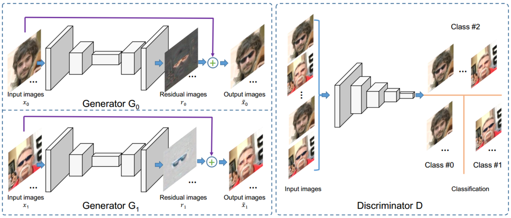

### Loss function for G

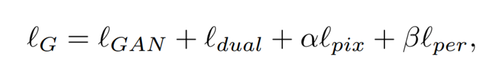

1. To make the residual image be sparse, apply an L-1 norm regularization in G.
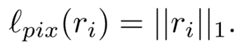

2. To encourage the transformed image to have similar content to the input face image, apply perceptual loss in D
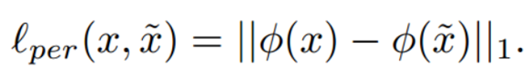

3. Image transformation
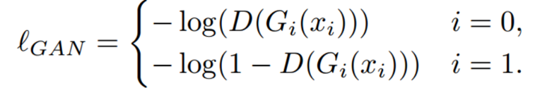

4. Dual Learning
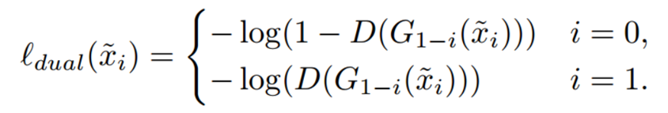

### Loss function for D

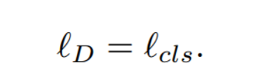

Given the real images x(0) and x(1) with known attribute label 0 and label 1, we regard the transformed images x’(0) and x’(1) as an extra category with label 2.

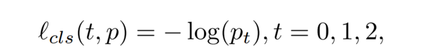

where t is the label of the image and p(t) is the softmax probability of the t-th label.

### Experiments
Experiments show that the learned residual images successfully simulate the manipulations and the generated images retain most of the details in attribute-irrelevant areas.

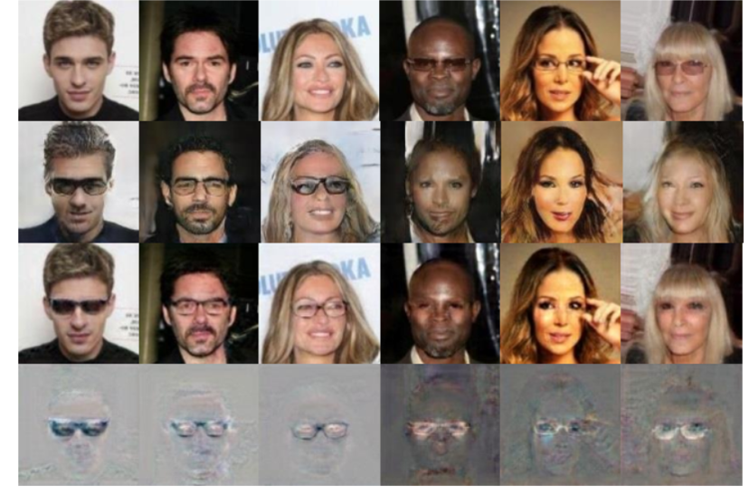

## Age Progression/Regression by Conditional Adversarial Autoencoder
### Main idea
(1) The authors propose a conditional adversarial autoencoder (CAAE) that learns a face manifold, traversing on which smooth age progression and regression can be realized simultaneously. 

(2) In CAAE, the face is first mapped to a latent vector through a convolutional encoder, and then the vector is projected to the face manifold conditional on age through a deconvolutional generator.

(3) The generative model can directly produce the image with desired age attribute, given an unlabeled image without paired samples in training.

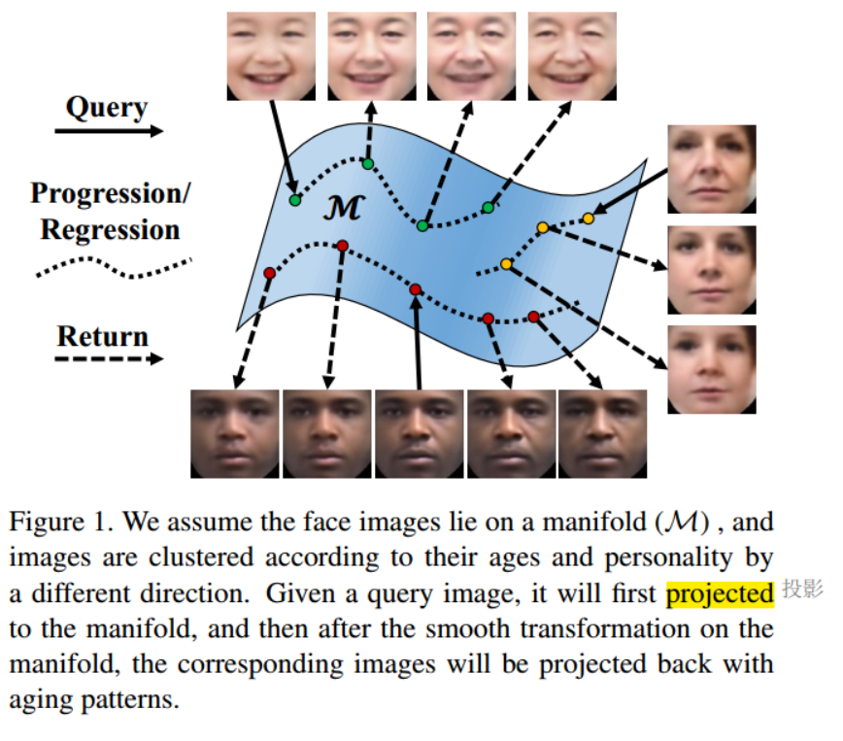

The latent vector preserves personalized face features (i.e., personality) and the age condition controling progression vs. regression. 

### CAAE

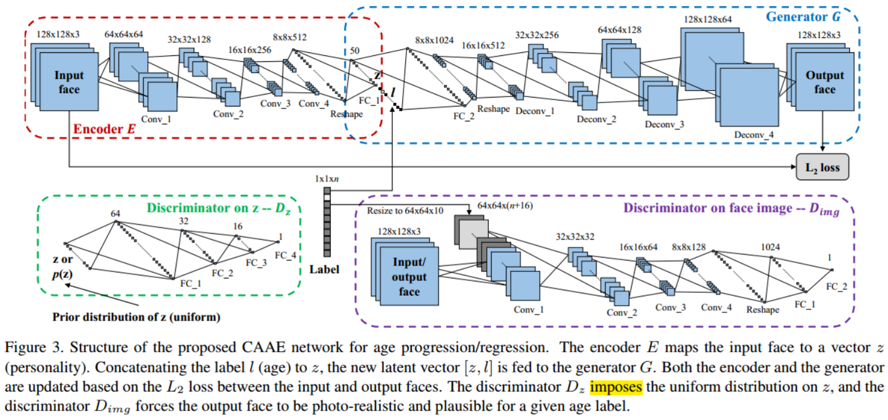

1. Autoencoder E(x)=z: the ouput z preserves the high-level personal feature of the input face x.

2. Generator G(z,l)=z^: the output face conditioned on certain age and specific personality(z). 

3. D(z) regularizes z to be uniform distributed, smoothing the age transformation.
  - Using uniform distribution as the prior forces z to evenly populate the latent space with no apparent “holes”.
  - Exhibition of the “hole” indicates that face images generated by interpolating between arbitrary z’s may not lie on the face manifold
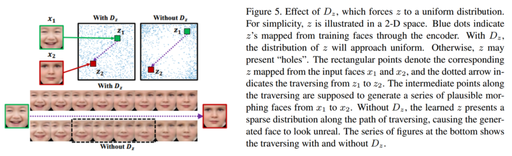

4. D(img) based on age and human face forces G to generate photo-realistic and plausible faces for arbitrary z and l. 
 - The pixel-wise loss could only make the framework generate a face close to the trained ones in a manner of interpolation, causing the generated face to be very blurred. 
 - The D(img) will discriminate the generated faces from real ones in aspects of reality, age, resolution.
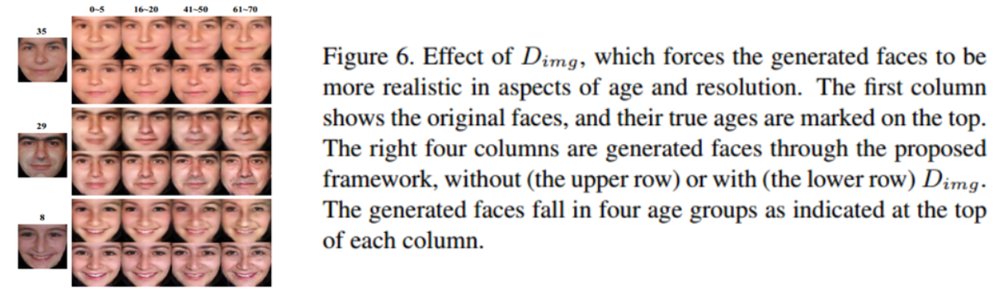

### Objective Function

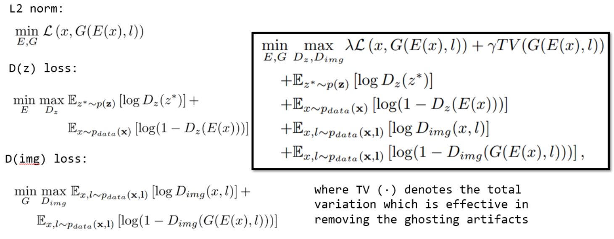

### Experiments

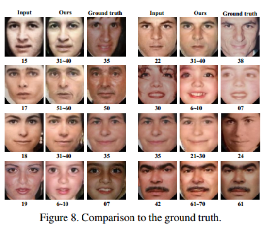

## Disentangled Representation Learning GAN for Pose-Invariant Face Recognition
### Main idea
(1) The authors proposes Disentangled Representation Learning-Generative Adversarial Network (DR-GAN) with three distinct novelties:

(2) The encoder-decoder structure of the generator allows DR-GAN to learn the identity representation for each face image, in addition to image synthesis.

(3) This representation is explicitly disentangled from other face variations such as pose, through the pose code provided to the decoder and pose estimation in the discriminator.

(4) DRGAN can take one or multiple images as the input, and generate one integrated representation along with an arbitrary number of synthetic images.

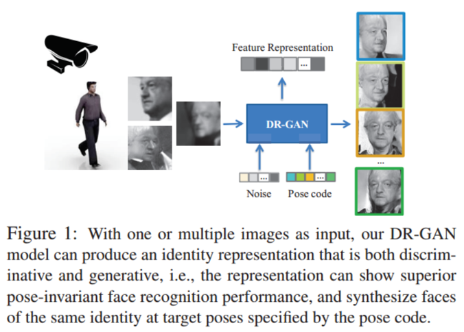

### Architecture
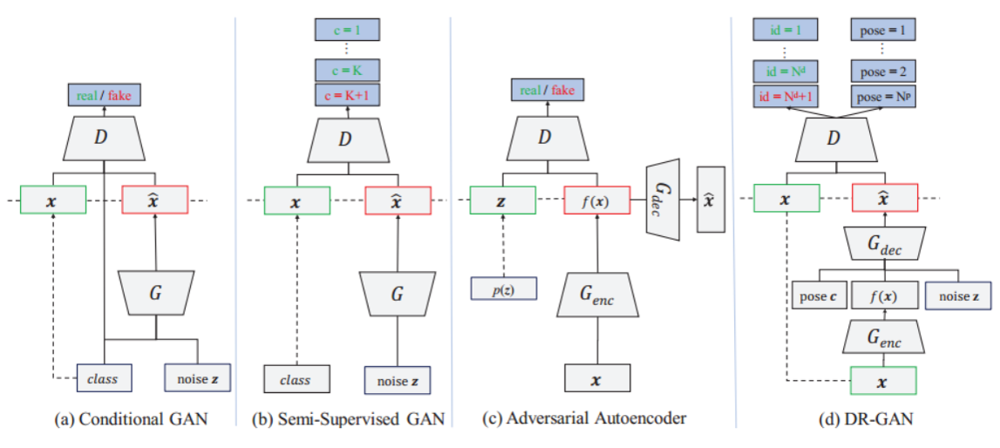

For any face image x with label y = {y(d), y(p)}, where y(d) represents the label for identity and y(p) for pose, we are interested in generating a new face image x’ with the same identity y(d) but a different pose controlled by a pose code c. 

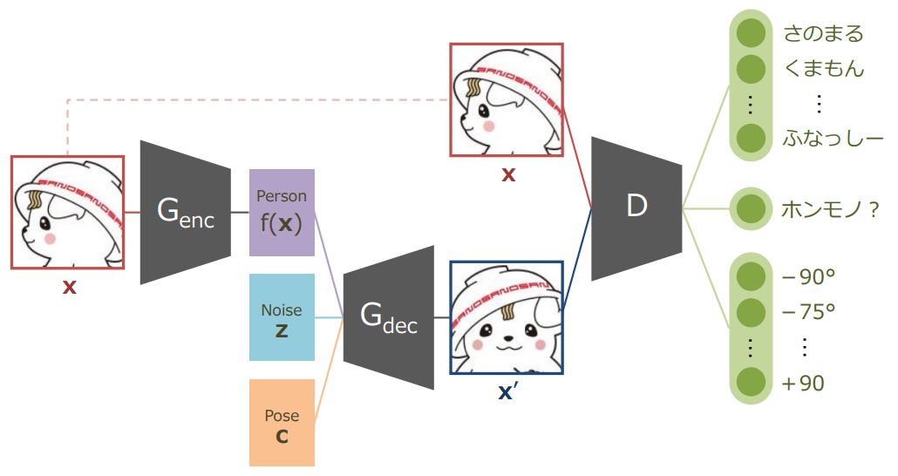

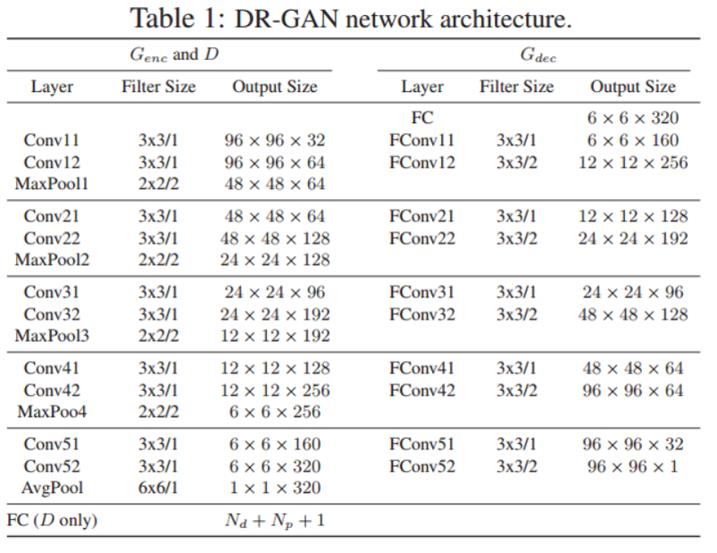

### Single-Image DR-GAN
D consists of two parts: D = [D(d), D(p)].
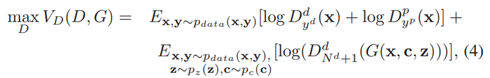

- D(d) is used for identity classification with N(d) representing the total number of identities in the training set and the additional dimension is for fake/real classification. 

- D(p) is used for pose classification with N(p) denoting the total number of poses.  

G consists of G(enc) and G(dec).
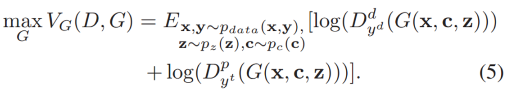

- G(enc) aims for identity representation learning from a face image x:
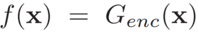

- G(dec) aims to synthesize a face image x’ with identity y(d) and a target pose specified by c, and z is the noise used to model variance other than identity and pose. 
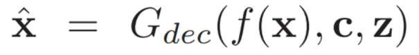

### Multi-Image DR-GAN
Multi-Image DR-GAN has the same D as single-image DR-GAN, but different G. Beside extracting features f(x), G(enc) add one more convolution channel to estimate a confident coefficient ω, which predicts the quality of the learnt representation.

the fused representation:
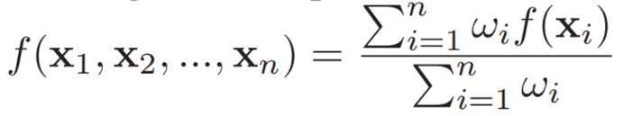

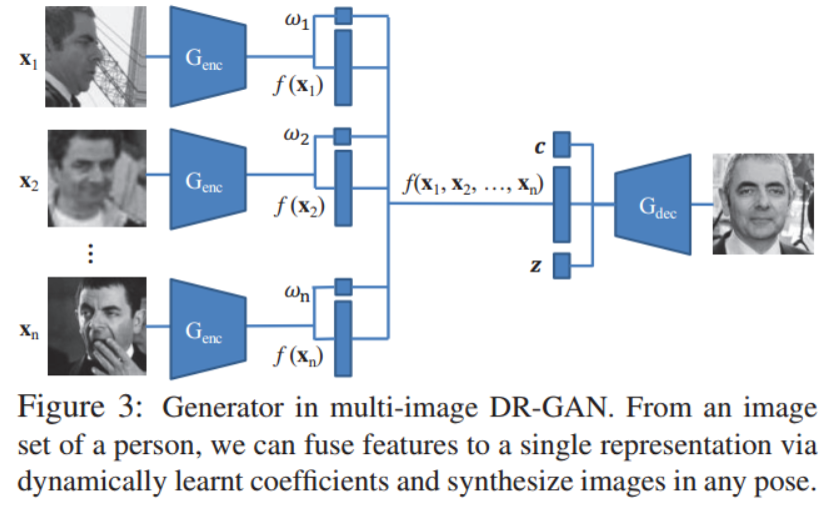

The generated image is expected to share the same identity with all input images. Thus, the objective function for learning G has a total of 2(n + 1) terms to maximize:

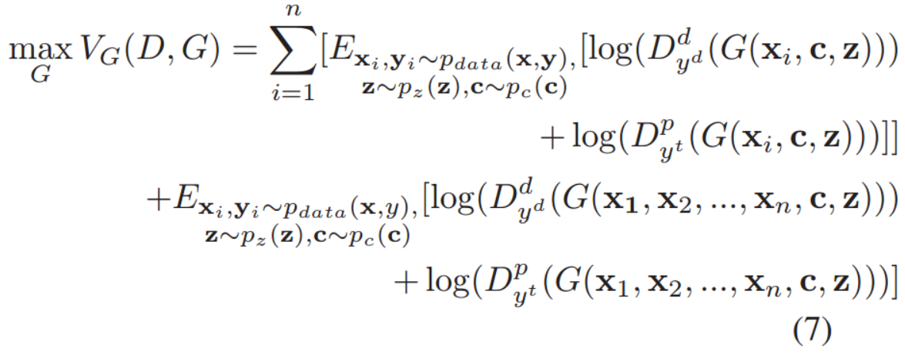

To mimic the variation in the number of input images, we use a simple but effective trick: applying drop-out on the coefficient ω. Hence, during training, the network can take any number of inputs from 1 to n.

### Experiments
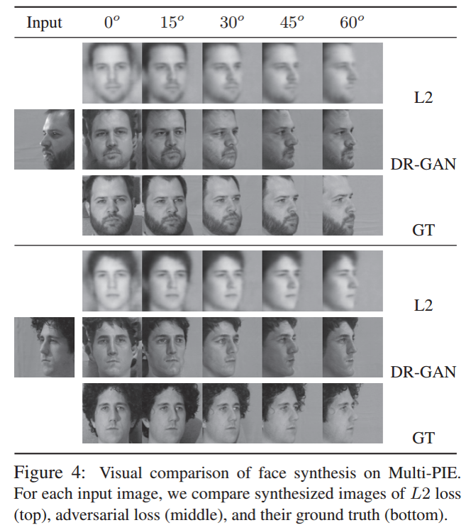

## Tag Disentangled Generative Adversarial Networks for Object Image Re-rendering
### Main idea
The authors propose a principled Tag Disentangled Generative Adversarial Networks(TD-GAN), which consist of a disentangling network, a generative network, a tag mapping net and a discriminative network, for re-rendering new images for the object from a single image based on specific multiple scene properties.

### Motivation
Despite the great progress achieved in image re-rendering, one worrying shortage is regarding the effectiveness and independence of the (disentangled) representations extracted from the input image. 

For most existing methods, (disentangled) representations are mostly extracted from images themselves, and the valuable tag information (e.g., photograph conditions and object characterizations) associated with images has not been finely explored. 

There was little attempt to make the re-rendering result more realistic by increasing the difficulty in distinguishing genuine and re-rendered images.

### Architecture

### Consistency between images and tags
Exploring consistency between the image and its tags. The image and its tags consistently represent the same object, despite the difference in physical properties, respectively a visual approach and a textual or parametric way.

- the disentangling network R aims to extract the disentangled representations R(x) of the input image x.
- the tag mapping net g aims to obtain the disentangled representations g(C) of the tags.
- the first objective of TD-GAN is to penalize the discrepancy between the disentangled representations R(x) and g(C) generated from the image and its tags. 

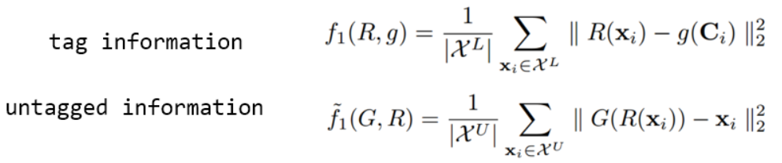

### rendering
To maximize the rendering capability of network G, we tend to minimize the discrepancy between genuine images and rendered images.

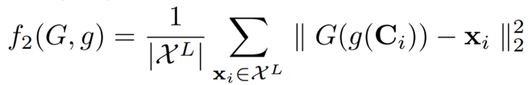

To provide a strong driving force for continuously improving the re-rendering performance, we introduce the discriminative network D into TD-GAN.

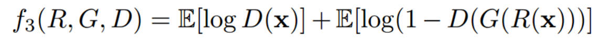

### Training Process
TD-GAN is composed of R, D, G and g, which can be optimized and learned using the alternating optimization strategy.

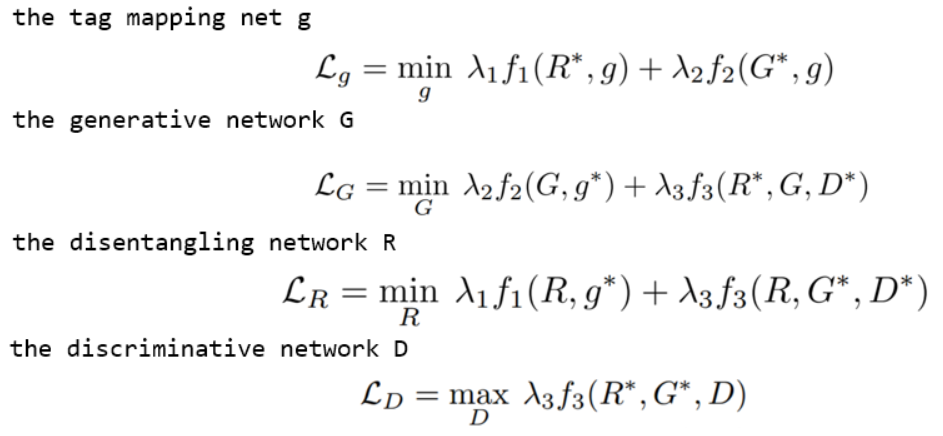

