<!-- TOC -->

- [Image translation](#image-translation)
    - [Coupled Generative Adversarial Networks](#coupled-generative-adversarial-networks)
        - [Main idea](#main-idea)
        - [Architecture](#architecture)
        - [Models](#models)
        - [Learning](#learning)
    - [Invertible Conditional GANs for image editing](#invertible-conditional-gans-for-image-editing)
        - [Main idea](#main-idea)
        - [Motivation](#motivation)
        - [Encoder](#encoder)
        - [cGAN](#cgan)
        - [Architecture](#architecture)
    - [Image-to-image translation using conditional adversarial nets](#image-to-image-translation-using-conditional-adversarial-nets)
        - [Main idea](#main-idea)
        - [Objective](#objective)
        - [Architrcture](#architrcture)
        - [Experiments](#experiments)
    - [Unpaired Image-to-Image Translation using Cycle-Consistent Adversarial Networks](#unpaired-image-to-image-translation-using-cycle-consistent-adversarial-networks)
        - [Main idea](#main-idea)
        - [Motivation](#motivation)
        - [Formulation](#formulation)
        - [Training](#training)
    - [DeblurGAN: Blind Motion Deblurring Using Conditional Adversarial Networks](#deblurgan-blind-motion-deblurring-using-conditional-adversarial-networks)
        - [Main idea](#main-idea)
    - [StarGAN: Unified Generative Adversarial Networks for Multi-Domain Image-to-Image Translation](#stargan-unified-generative-adversarial-networks-for-multi-domain-image-to-image-translation)
        - [Main idea](#main-idea)
        - [Motivation](#motivation)
        - [Overview](#overview)
        - [Loss function](#loss-function)
        - [Training with Multiple Datasets](#training-with-multiple-datasets)

<!-- /TOC -->
# Image translation
## Coupled Generative Adversarial Networks
### Main idea
(1) The authors propose coupled generative adversarial network(CoGAN) for learning a joint distribution of multi-domain images, with just samples drawn from the marginal distributions.

(2) CoGAN is achieved by enforcing a weight-sharing constraint that limits the network capacity and favors a joint distribution solution over a product of marginal distributions one.

### Architecture

### Models
Generative Models

1. The first few layers that decode high-level semantics share the weights, forcing the high-level semantics to be decoded in the same way.

2. The last few layers that decode low-level semantics map the shared representation to images in individual domains for confusing the respective discriminative models.

Discriminative Models

1. The weight-sharing constraint in the discriminative helps reduce the total number of parameters in the network, but it is not essential for learning a joint distribution

### Learning
The CoGAN framework corresponds to a constrained minmax game given by

## Invertible Conditional GANs for image editing
### Main idea
(1) The authors evaluate encoders to inverse the mapping of a cGAN, mapping a real image into a latent space and a conditional representation. This allows, for example, to reconstruct and modify real images of faces conditioning on arbitrary attributes. 

(2) Additionally, the authors evaluate the design of cGANs. The combination of an encoder with a cGAN, which we call Invertible cGAN (IcGAN), enables to re-generate real images with deterministic complex modifications.

### Motivation
The GAN framework lacks an inference mechanism, finding the latent representation of an input image, which is a necessary step for being able to reconstruct and modify real images.

### Encoder

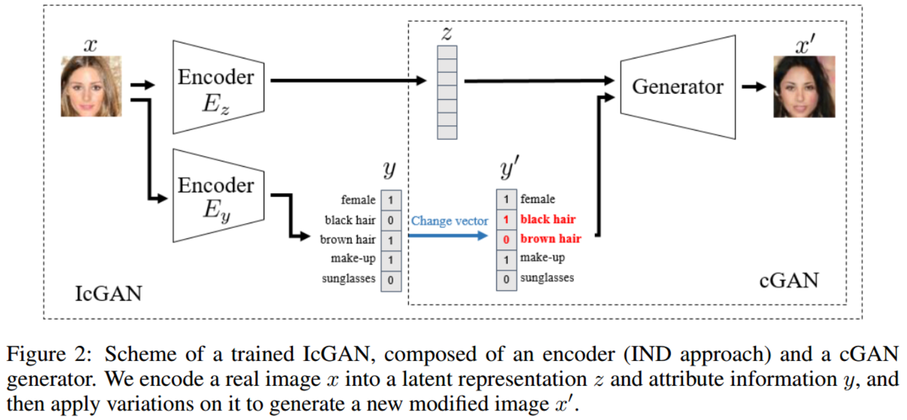

The authors train an encoder E once the cGAN has been trained, where the encoder is composed of two sub-encoders: E(z)-encodes an image to latent representation z, E(y)-encodes an image to atrribute information y.

To train Ez, we use the generator to create a dataset of generated images x' and their latent vectors z, and then minimize a squared reconstruction loss L(ez).

For Ey, we initially used generated images x' and their conditional information y' for training. However, we found that generated images tend to be noisier than real ones and, in this specific case, we could improve Ey by directly training with real images and labels from the dataset pdata.

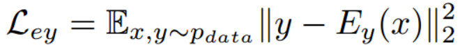

### cGAN

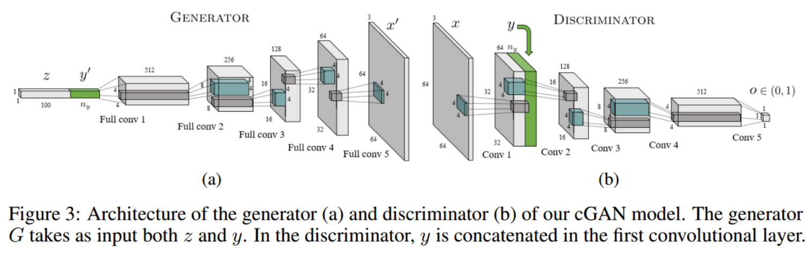

The authors consider two main design decisions concerning cGANs: the optimal conditional position y on the generator and discriminator, the best approach to sample conditional information for the generator.

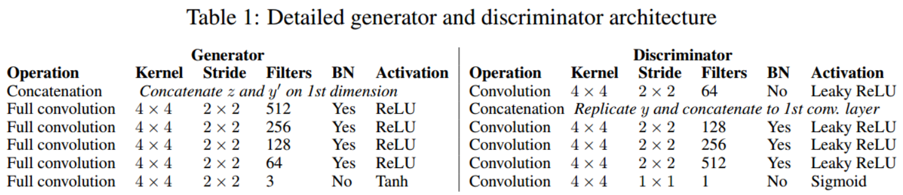

The best accuracy is achieved by inserting y in the first convolutional layer of the discriminator and at the input level for the generator.

different sampling approaches:
- Kernel density estimation: randomly sampling from a kernel
- Direct interpolation: interpolate between label vectors y from the training set
- Sampling from the training set y'~p(y), p(y) = p(data): Use directly the real labels y from the training set pdata. 

In this case where the attributes of an image are binary, one attribute vector y could describe a varied and large enough subset of images, preventing the model from overfitting given y. The authors will
directly sample y from pdata because Kernel density estimation and interpolation are not suitable for binary ones.

### Architecture
Detailed generator and discriminator architecture

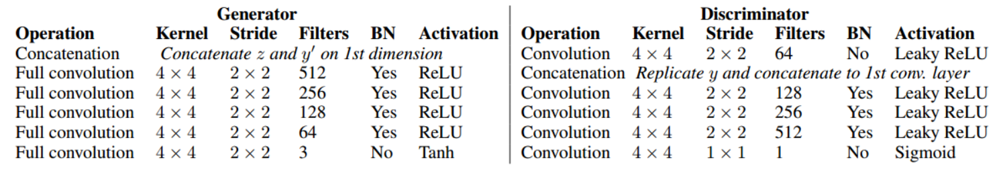

the architecture of the IND encoder: Batch Normalization and non-linear activation functions are removed from the last layer to guarantee that the output distribution is similar to pz = N (0; 1). 

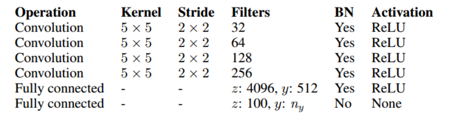

## Image-to-image translation using conditional adversarial nets
### Main idea
The authors investigate conditional adversarial networks, called pix2pix, as a general-purpose solution to image-to-image translation problems. 

These networks not only learn the mapping from input image to output image, but also learn a loss function to train this mapping, which makes it possible to apply the same generic approach to problems that traditionally would require very different loss formulations.

### Objective

Without z, the net could still learn a mapping from x to y, but would produce deterministic outputs, and therefore fail to match any distribution other than a delta function. 

But in experiments, we found that the generator simply learned to ignore the noise and dropout produce only minor stochasticity in generated images.

Designing conditional GANs that produce highly stochastic output, and thereby capture the full entropy of the conditional distributions they model, is an important question left open by the present work.

### Architrcture
Unet

For many image translation problems, there is a great deal of low-level information shared between the input and output, and it would be desirable to shuttle this information directly across the net.

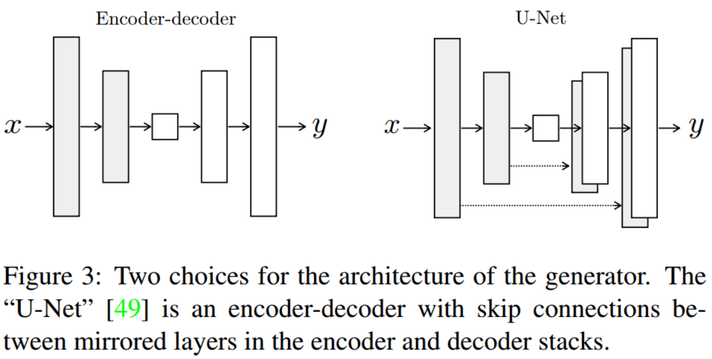

PatchGAN

 L1 term forces low-frequency correctness, which motivates restricting the GAN discriminator to only model high-frequency structure. We design a discriminator architecture – which we term a PatchGAN – that only penalizes structure at the scale of patches. This discriminator tries to classify if each N × N patch in an image is real or fake. 

 Such a discriminator effectively models the image as a Markov random field, assuming independence between pixels separated by more than a patch diameter.

### Experiments
analysis of the generator architecture

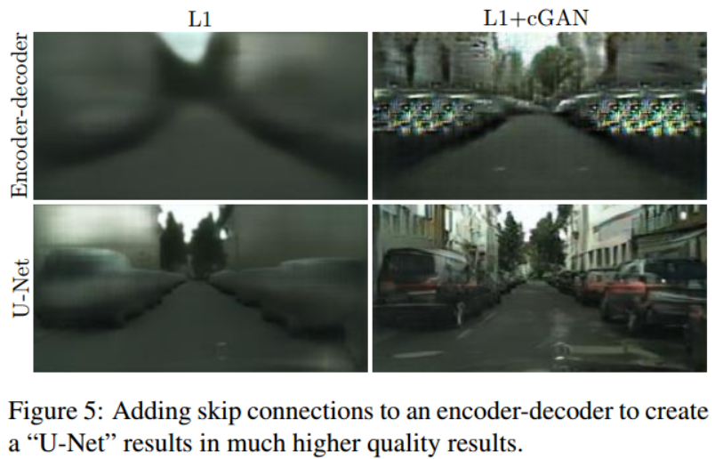

From PixelGANs to PatchGANs to ImageGANs

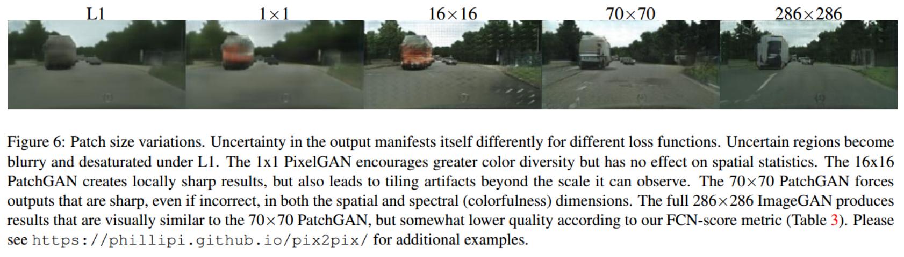

 The full 286 × 286 ImageGAN gets a considerably lower FCN-score, which may be because the ImageGAN has many more parameters and greater depth than the 70 × 70 PatchGAN, and may be harder to train.

## Unpaired Image-to-Image Translation using Cycle-Consistent Adversarial Networks
### Main idea
The authors present an approach for learning to translate an image from a source domain X to a target domain Y in the absence of paired examples. The goal is to learn a mapping G : X -> Y such that the distribution of images from G(X) is indistinguishable from the distribution Y using an adversarial loss.

Because the mapping is highly under-constrained, we couple it with an inverse mapping F : Y -> X and introduce a cycle consistency loss to enforce F (G(X)) ≈ X (and vice versa).

### Motivation

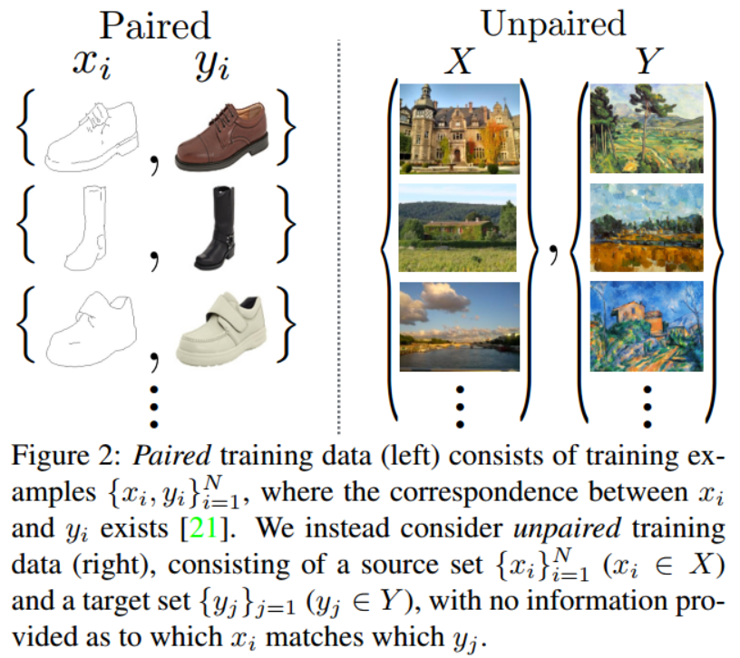

(1) Image-to-image translation is a class of vision and graphics problems where the goal is to learn the mapping between an input image and an output image using a training set of aligned image pairs. However, for many tasks, paired training data will not be available. 

(2) Obtaining paired training data can be difficult and expensive.For example, only a couple of datasets exist for tasks like semantic segmentation, and they are relatively small. 

### Formulation

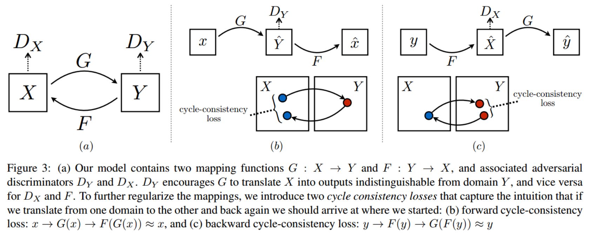

Adversarial Loss

For the mapping function G:X->Y and its discriminator DY

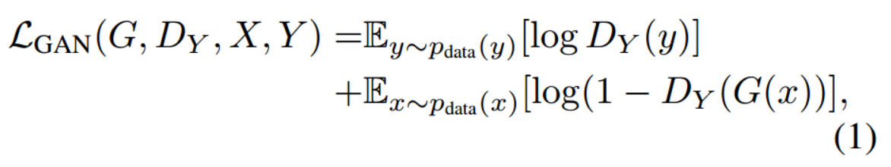

We introduce a similar adversarial loss for the mapping function F:Y->X and its discriminator DX as well: min(F)max(DX) L(F, DX, Y, X)

Cycle Consistency Loss

Adversarial losses alone cannot guarantee that the learned function can map an individual input x(i) to a desired output y(i). To further reduce the space of possible mapping functions, we argue that the learned mapping functions should be cycle-consistent.

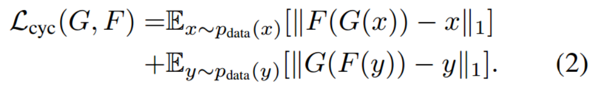

full objective

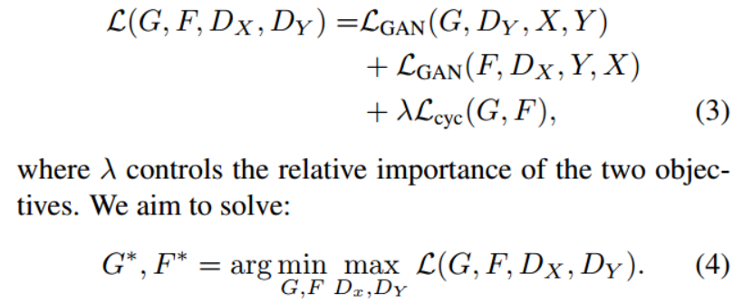

### Training
The aithors apply two techniques from recent works to stabilize our model training procedure:
- replace the negative log likelihood objective by a least-squares loss which is more stable during training and generates higher quality results.
- to reduce model oscillation, use a history of generated images rather than the ones produced by the latest generative networks, keeping an image buffer that stores the 50 previously generated images

## DeblurGAN: Blind Motion Deblurring Using Conditional Adversarial Networks
### Main idea

## StarGAN: Unified Generative Adversarial Networks for Multi-Domain Image-to-Image Translation
### Main idea
(1) The authors propose StarGAN, a novel and scalable approach that can perform image-to-image translations for multiple domains using only a single model.

(2) Such a unified model architecture of StarGAN allows simultaneous training of multiple datasets with different domains within a single network, which leads to StarGAN’s superior quality of translated images as well as the flexibility  of translating an input image to any desired target domain.

### Motivation
Existing models in multi-domain image translation tasks are both inefficient and ineffective.

- inefficiency: in order to learn all mappings among k domains, k(k−1) generators have to be trained.

- ineffective: there exist global features that can be learned from images of all domains such as face shapes, each generator cannot fully utilize the entire training data and only can learn from two domains out of k. 

- they are incapable of jointly training domains from different datasets because each dataset is partially labeled

### Overview

### Loss function
Adversarial Loss:

Where G generates an image G(x;c) conditioned on both the input image x and the target domain label c, while D tries to distinguish between real and fake images. 

Domain Classification Loss:

Where a domain classification loss of real images used to optimize D, and a domain classification loss of fake images used to optimize G. 

Reconstruction Loss:

where G takes in the translated image G(x; c) and the original domain label c’ as input and tries to reconstruct the original image x. That is to preserve the content of its input images while changing only the domain-related part of the inputs.

Full Objective:

where λ(cls) and λ(rec) are hyper-parameters that control the relative importance of domain classification and reconstruction losses, respectively, compared to the adversarial loss.

### Training with Multiple Datasets
Mask Vector:

we introduce a mask vector m that allows StarGAN to ignore unspecified labels and focus on the explicitly known label provided by a particular dataset.

where [·] refers to concatenation, and c(i) represents a vector for the labels of the i-th dataset, and m represents an n-dimensional one-hot vector, with n being the number of datasets.

Training Strategy: we train the model in a multi-task learning setting, where the discriminator tries to minimize only the classification error associated to the known label, using mask vector.