# Re-identification

## Pose Guided Person Image Generation
### Main idea
The authors propose the novel Pose Guided Person Generation network(PG2), which utilizes the pose information explicitly and consists of two key stages: pose integration and image refinement.

### Architecture

### Stage-I:Pose integration
Generator G1: a U-Net-like architecture convolutional autoencoder with skip connections.

- Stacked convolutional layers integrate the information of I(a) and P(b) and transfer information to neighboring body parts.
- A fully connected layer is used such that information between distant body parts can exchange information.
- Skip connections between encoder and decoder help propagate image information directly from input to output.

Pose mask loss: we adopt L1 loss between generation and target images with a pose mask MB, which alleviates the influence of background from the condition image.

The output of G1 is blurry because the L1 loss encourages the result to be an average of all possible cases. However, G1 does capture the global structural information specified by the target pose, as well as other low-frequency information such as the color of clothes. 

### Stage-II:Image refinement
Generator G2: G2 aims to generate an appearance difference map between initial result I’(b) and target I(b), with I’(b) and I(a) as input.

The use of difference maps speeds up the convergence of model training since the model focuses on learning the missing appearance details.

The fully-connected layer is removed from   the U-Net which helps to preserve more details from the input because a fully-connected layer compresses a lot of information contained in the input.

### Stage-III: Discriminator
Discriminator D: D to recognize the pairs’ fakery (I’(b2),I(a)) vs (I(b),I(a)), which encourages D to learn the distinction between I’(b2) and I(b) instead of only the distinction between synthesized and natural images.

- Without pairwise input, we worry that G2 will be mislead to directly output I(a) which is natural by itself instead of refining the coarse result of the first stage I’(b1).
- When λ is small, the adversarial loss dominates the training and it is more likely to generate artifacts; when λ is big, the generator with a basic L1 loss dominates the training, making the whole model generate blurry results.

## Deformable GANs for Pose-based Human Image Generation
### Main idea
Specifically, given an image of a person and a target pose, we synthesize a new image of that person in the novel pose. In order to deal with pixel-to-pixel misalignments caused by the pose differences, the authors introduce deformable skip connections in the generator of our Generative Adversarial Network. 

Moreover, a nearest-neighbour loss is proposed instead of the common L1 and L2 losses in order to match the details of the generated image with the target image.

### Motivation
Pose-based human-being image generation is motivated by the interest in synthesizing videos with non-trivial human movements or in generating rare poses for human pose estimation or re-identification training datasets.

Most of these methods have problems when dealing with large spatial deformations between the conditioning and the target image. For instance, the assumption used in U-Net architecture is that x and y are roughly aligned with each other and they represent the same underlying structure. 

### Architecture

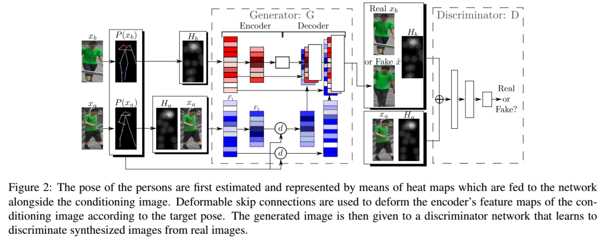

P(x) = (p1,...pk) is a sequence of k 2D points describing the locations of the human-body joints in x, which is extracted using the Human Pose Estimator.

 H = H(P(x)) is composed of k heat maps, where Hj (1 ≤ j ≤ k) is a 2D matrix of the same dimension as the original image. If pj is the j-th joint location, then:

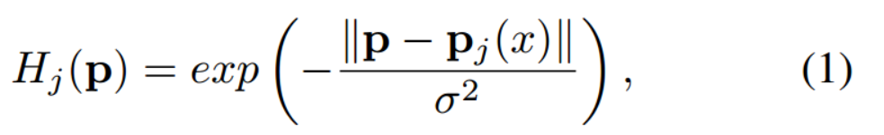

The joint locations in x(a) and H(a) are spatially aligned (by construction), while in H(b) they are different. Hence, H(b) is not concatenated with the other input tensors, because the convolutional layers in the encoder part of G have a small receptive field which cannot capture large spatial displacements.

Specifically, x(a) and H(a) are concatenated and processed using a convolutional stream of the encoder while H(b) is processed by means of a second convolutional stream, with no-shared weights. The feature maps of the first stream are then fused with the layer-specific convolutional feature maps of the second stream in the decoder part of G after a pose-driven spatial deformation performed by our deformable skip connections.

### Deformable skip connections

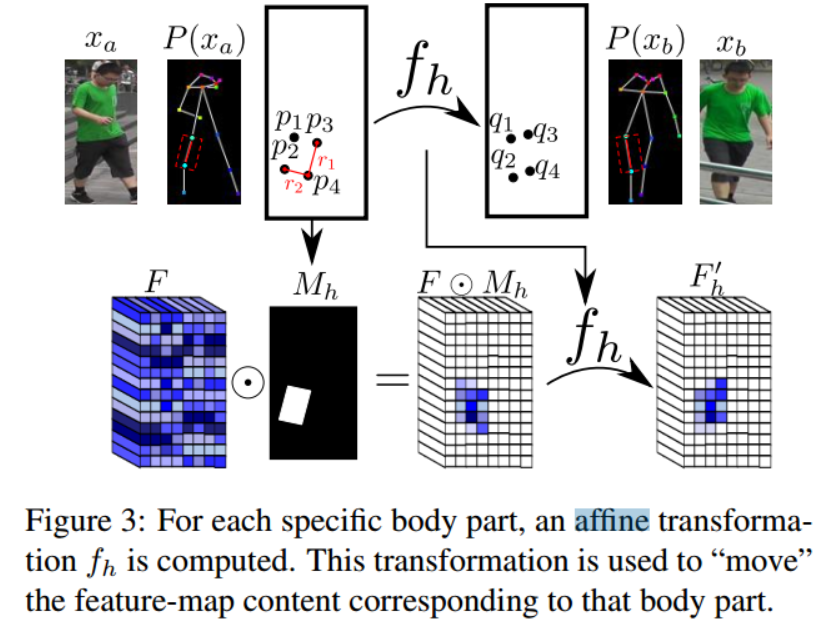

1) Decomposing an articulated body in a set of rigid subparts

2) Computing a set of affine transformations fh(·;kh) using Least Squares Error
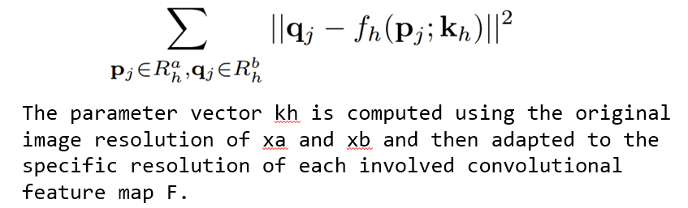

3) Combining affine transformations to approximate the object deformation.

### Training
D and G are trained using a combination of a standard conditional adversarial loss LcGAN with our proposed nearest-neighbour loss LNN.

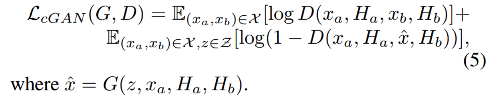

We hypothesize pixel-to-pixel loss such as L1 fails to tolerate small spatial misalignments between x' and xb. In order to alleviate this problem, we propose to use a nearest-neighbour loss LNN based on the following definition of image difference:

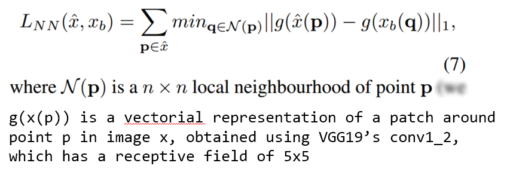

total objective

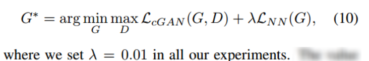

### Experiments
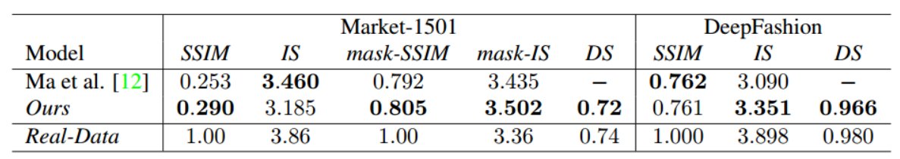

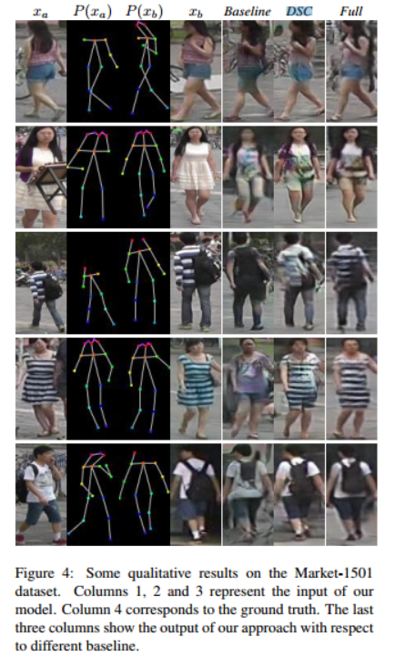

## Camera Style Adaptation for Person Re-identification
### Main idea
Being a cross-camera retrieval task, person reidentification suffers from image style variations caused by different cameras. In this paper, we explicitly consider this challenge by introducing camera style (CamStyle) adaptation, where CamStyle can serve as a data augmentation approach that smooths the camera style disparities.

Specifically, with CycleGAN, labeled training images can be style-transferred to each camera, and, along with the original training samples, form the augmented training set. 

While increasing data diversity against over-fitting, also incurs a considerable level of noise. In the effort to alleviate the impact of noise, the label smooth regularization (LSR) is adopted. The vanilla version of our method (without LSR) performs reasonably well on few-camera systems in which over-fitting often occurs. 

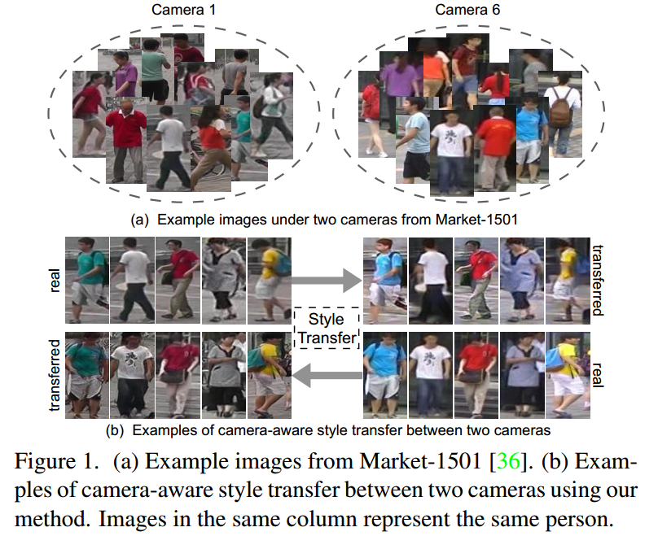

### Motivation
To learn rich features robust to camera variations, annotating large-scale datasets is useful but prohibitively expensive. 

Nevertheless, if we can add more samples to the training set that are aware of the style differences between cameras, we are able to 1) address the data scarcity problem in person re-ID and 2) learn invariant features across different cameras. 

Preferably, this process should not cost any more human labeling, so that the budget is kept low.

### CycleGAN Review
Given two datasets {xi} and {yj}, collected from two different domains A and B, where xi ~ A and yj ~ B, The goal of CycleGAN is to learn two mapping function: G: A->B and F: B->A. 

The overall CycleGAN loss function is expressed as:

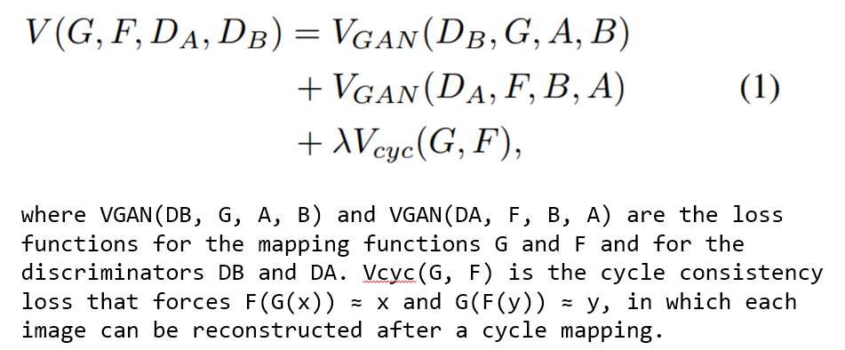

### Camera-aware Image-Image Translation
In this work, the authors employ CycleGAN to generate new training samples: the styles between different cameras are considered as different domains. 

To encourage the styletransfer to preserve the color consistency between the input and output, the authors add the identity mapping loss in the CycleGAN loss function.

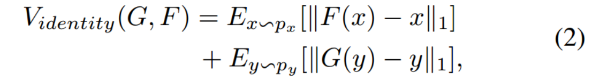

With the learned CycleGAN models, for a training image collected from a certain camera, we generate L − 1 new training samples whose styles are similar to the corresponding cameras

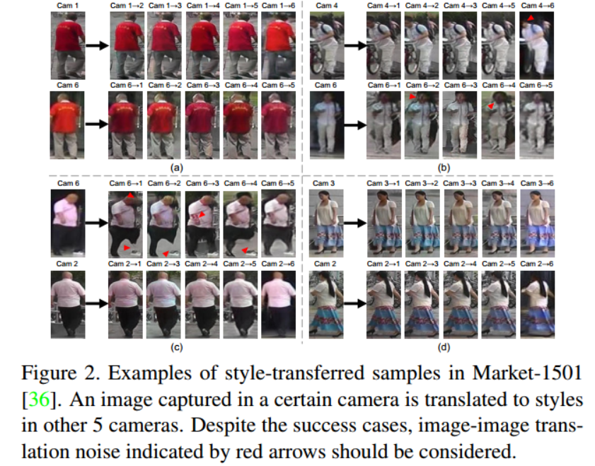

Then we leverage the style-transferred images as well as their associated labels to train re-ID CNN in together with the original training samples. 

### Baseline Deep Re-ID Model
Given that both the real and fake (style-transferred) images have ID labels, the authors use the ID-discriminative embedding (IDE) to train the re-ID CNN model. Using the Softmax loss, IDE regards re-ID training as an image classification task.

The authors discard the last 1000-dimensional classification layer and add two fully connected layers. The first FC layer has 1024 dimensions named as "FC-1024", the second FC layer, is C-dimensional, where C is the number of classes in the training set.

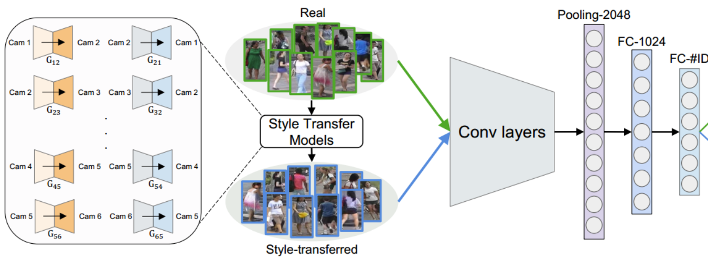

### Training with CamStyle
In the vanilla version, each sample in the new training set belongs to a single identity. During training, in each mini-batch, we randomly select M real images and N fake images. The loss function can be written as:

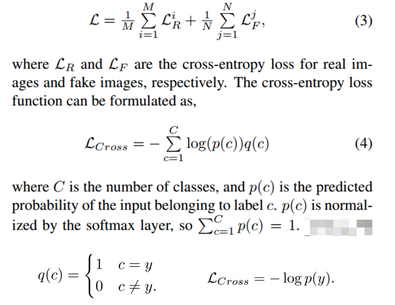

In the full version, when considering the noise introduced by the fake samples, we introduce the full version which includes the label smooth regularization (LSR)

That is, we assign less confidence on the ground-truth label and assign small weights to the other classes. 

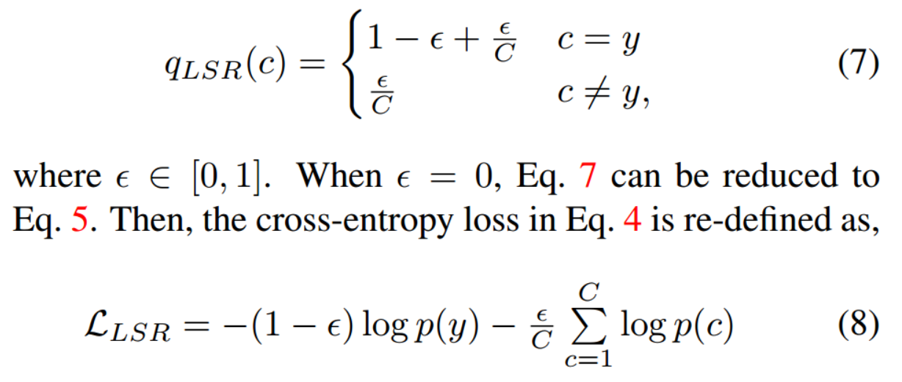

For real images, we do not use LSR because their labels correctly match the image content.

### Discussions
the working mechanism of the proposed data augmentation method mainly consists in: 
1) the similar data distribution between the real and fake (style-transferred) images, and 
2) the ID labels of the fake images are preserved. 

In the first aspect, the fake images fill up the gaps between real data points and marginally expand the class borders in the feature space.

The second aspect, on the other hand, supports the usage of supervised learning, a different mechanism from which leverages unlabeled GAN images for regularization.

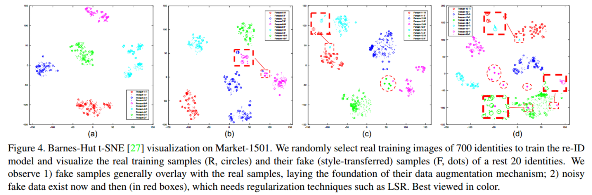

### Experiments
Evaluation with different ratio of real data and fake data (M:N) 

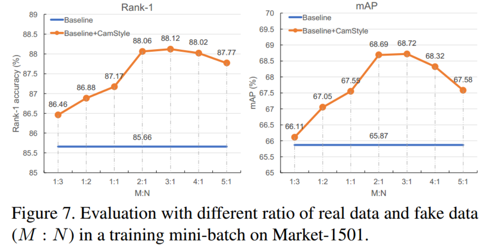

Variant Evaluation

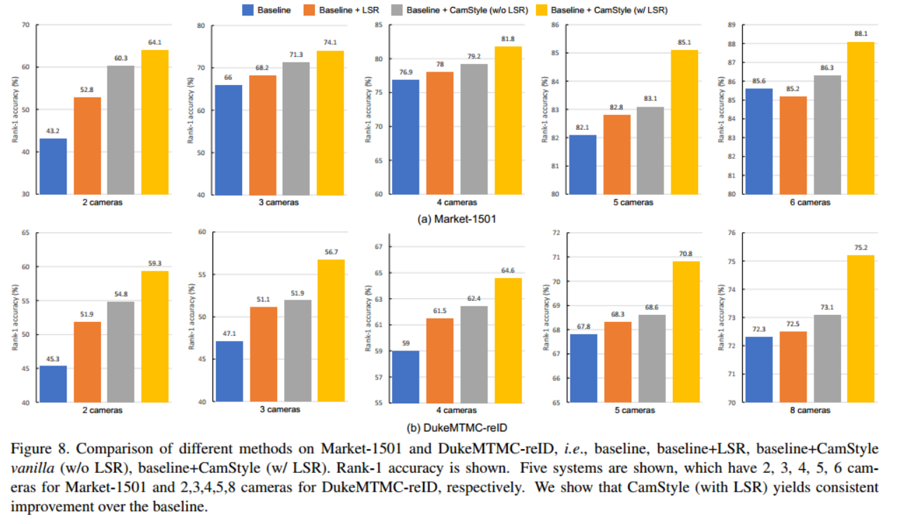
