<!-- TOC -->

- [WRN](#wrn)
    - [Main idea](#main-idea)
    - [Motivation](#motivation)
    - [Architecture](#architecture)
- [ResNeXt](#resnext)
    - [Main idea](#main-idea-1)
    - [Motivation](#motivation-1)
    - [Architecture](#architecture-1)
- [DenseNet](#densenet)
    - [Main idea](#main-idea-2)
    - [Motivation](#motivation-2)
    - [Architecture](#architecture-2)
    - [Thinking](#thinking)
- [MobileNet](#mobilenet)
    - [Main idea](#main-idea-3)
    - [Motivation](#motivation-3)
    - [Architecture](#architecture-3)
- [ShuffleNet](#shufflenet)
    - [Main idea](#main-idea-4)
    - [Motivation](#motivation-4)
    - [Architecture](#architecture-4)
- [DPN](#dpn)
    - [Main idea](#main-idea-5)
    - [Movtivation](#movtivation)

<!-- /TOC -->

## WRN
### Main idea
- this paper proposes an architecture which decreases depth and increases width of residual networks. In particular, author presents wider deep residual networks that significantly improve over Resnet, having 50 times less layers and being more than 2 times faster.
- Additionally, this paper shows that the widening of ResNet blocks (if done properly) provides a much more effective way of improving performance of residual networks compared to increasing their depth, which  indicates that the main power of deep residual networks is in residual blocks while the effect of depth is supplementary

### Motivation
- For deep residual networks, each fraction of a percent of improved accuracy costs nearly doubling the number of layers
- As gradient flows through the network, there is nothing to force it to go through residual block weights and it can avoid learning anything during training. So it is possible that there is either only a few blocks that learn useful representations, or many blocks share very little information with small contribution to the final goal. This problem was formulated as diminishing feature reuse.
- author desires to explore a much richer set of network architectures of ResNet blocks and thoroughly examine how several other different aspects besides the order of activations affect performance.

### Architecture

- Type of convolutions in residual block: Block B(3;3) turned out to be the best by a little margin
- Number of convolutional layers per residual block: B(3;3) turned out to be the best
- Width of residual blocks, exactly an optimal d to k ratio: While the number of parameters increases linearly with l (the deepening factor) and d (the number of ResNet blocks), number of parameters and computational complexity are quadratic in k. However, it is more computationally effective to widen the layers than have thousands of small kernels as GPU is much more efficient in parallel computations on large tensors
 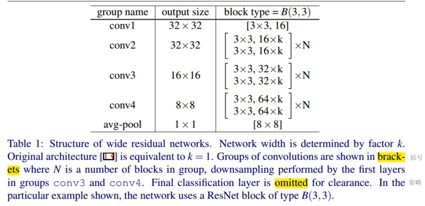
- Dropout in residual blocks: It is necesarry to regularize for increasing number of parameters because of widening. Residual networks already have batch normalization that provides a regularization effect, however it requires heavy data augmentation, which we would like to avoid, and it’s not always possible. 

## ResNeXt
### Main idea
- author presents a simple, highly modularized network architecture for which is constructed by repeating a building block that aggregates a set of transformations with the same topology.
- Increasing cardinality exposed by the strategy is more effective than going deeper or wider when we increase the capacity. 
- Compared with Inception, it is easier to adapt ResNeXt to new dataset/tasks, because it has only one the hyperparameter to fine-tune.

### Motivation
- Designing architectures becomes increasingly difficult with the growing number of hyper-parameters (width2, filter sizes, strides, etc.), especially when there are many layers. 
- Reflected by VGG and ResNet, stacking building blocks of the same shape reduces the free choices of hyperparamters and possibly reduces the risk of over-adapting the hyperparameters to a specific dataset.
- Demonstrated by Inception models, carefully designed topologies are able to achieve compelling accuracy with low theoretical complexity. Although split-transform-merge strategy of Inception models is so powerful but results in a series of complicating factors --  the filter numbers and sizes are tailored for each individual transformation, and the modules are customized stage-by-stage

### Architecture
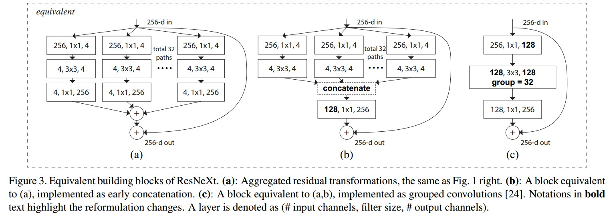

- The architecture adopts VGG/ResNets’ strategy of repeating layers, while exploiting the split-transform-merge strategy in an easy, extensible way. The transformations to be aggregated are all of the same topology which allows us to extend to any large number of transformations without specialized designs.
- Designing a template module under two rules, making all modules in a network can be determined accordingly, greatly narrow down the design space and allow us to focus on a few key factors.
- The module differs from all existing Inception modules in that all the paths share the same topology and thus the number of paths can be easily isolated as a factor to be investigated.
- Grouped convolutions greatly help implements of module showed in Figure (c), which avoids modifying source code of caffe. Splitting is essentially done by the grouped convolutional layer when it divides its input channels into groups. The grouped convolutional layer in Fig. 3(c) performs 32 groups of convolutions whose input and output channels are 4-dimensional. The grouped convolutional layer concatenates them as the outputs of the layer. 

## DenseNet
### Main idea
- Author proposes DenseNet where each layer obtains additional inputs from all preceding layers and passes on its own feature-maps to all subsequent layers.
- DenseNets have several compelling advantages: they alleviate the vanishing-gradient problem, strengthen feature propagation, encourage feature reuse, and substantially reduce the number of parameters. 
### Motivation
- Create short paths from early layers to later layers is helpful for addressing gradient vanishing. To ensure maximum information flow between layers in the network, author connects all layers (with matching feature-map sizes) directly with each other.
### Architecture

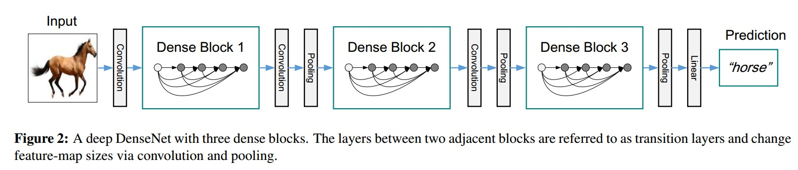

- Dense connectivity. To further improve the information flow between layers a different connectivity pattern is proposed: direct connections from any layer to all subsequent layers. Hence, the lth layer has l inputs, consisting of the feature-maps of all preceding convolutional blocks. Its own feature-maps are passed on to all L−l subsequent layers. 
- Pooling layers. To facilitate down-sampling in our architecture we divide the network into multiple densely connected dense blocks.
- Growth rate. H produces k featuremaps where the hyperparameter k is refered as the growth rate of the network, it follows that the l layer has k0 + k×(l−1) input feature-maps, where k0 is the number of channels in the input layer. 
- Bottleneck layers. A 1×1 convolution can be introduced as bottleneck layer before each 3×3 convolution to reduce the number of input feature-maps, and thus to improve computational efficiency. 
- Compression. To further improve model compactness, it is supposed to reduce the number of feature-maps at transition layers. If a dense block contains m feature-maps, we let the following transition layer generate [θm] output featuremaps, where 0<θ≤1 is referred to as the compression factor.

### Thinking
- DenseNet layers are very narrow (e.g., 12 filters per layer), adding only a small set of feature-maps to the “collective knowledge” of the network and keep the remaining featuremaps unchanged -- and the final classifier makes a decision based on all feature-maps in the network. This is why DenseNet requires fewer parameters than traditional convolutional networks, without relearning redundant feature-maps but reusing feature-maps. 
- Dense connections improve the flow of information and gradients throughout the network, which makes them easy to train and have a regularizing effect because of deep supervision, reducing overfitting on tasks with smaller training set sizes

## MobileNet
### Main idea
- MobileNets are based on a streamlined architecture that uses depthwise separable convolutions to build light weight deep neural networks. 
- Two simple global hyperparameters, width multiplier and resolution multiplier, allow the model builder to choose the right sized model by trading off between latency and accuracy.
### Motivation
- In many real world applications such as robotics, self-driving car and augmented reality, the recognition tasks need to be carried out in a timely fashion on a computationally limited platform.
- There has been rising interest in building small and efficient neural networks in the recent literature where many different approaches can be generally categorized into either compressing pretrained networks or training small networks directly. 
### Architecture

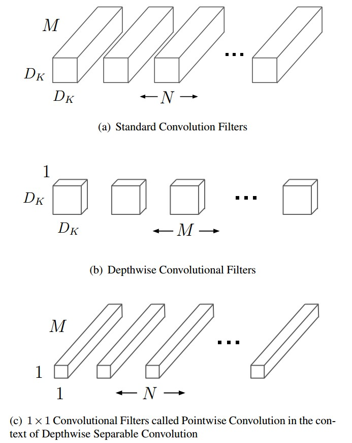

- Depthwise separable convolution are made up of two layers: depthwise convolutions and pointwise convolutions.Depthwise convolutions apply a single filter to each input channel (input depth), reflecting group convolutions. Pointwise convolution, a simple 1×1 convolution, is then used to create a linear combination of the output of the depthwise layer.

- Contrast between full convolution and depthwise separable convolution:
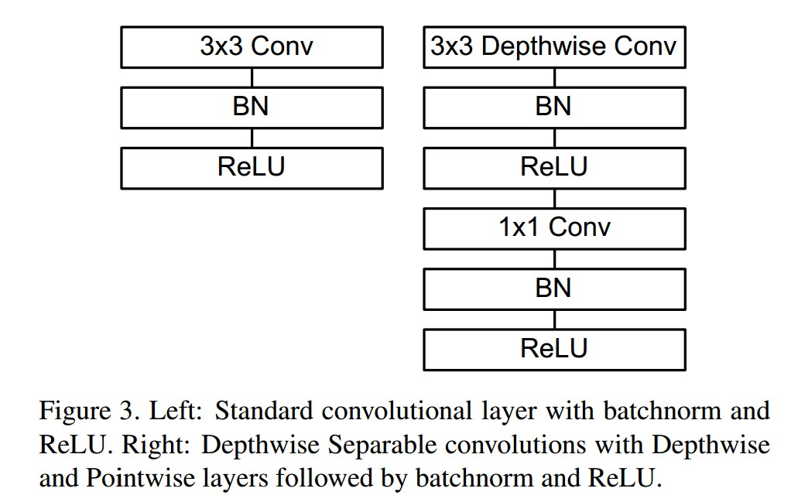

- By expressing convolution as a two step process of filtering and combining, MobileNet uses between 8 to 9 times less computation than standard convolutions at only a small reduction in accuracy:
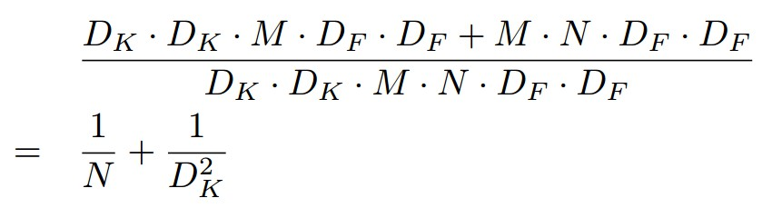

-  The model structure puts nearly all of the computation into dense 1 × 1 convolutions, which can be implemented with highly optimized general matrix multiply (GEMM) functions.
-  In order to construct a smaller and less computationally expensive models based on the constraints of a specific problem, author introduces two very simple parameter α called width multiplier and resolution multiplier ρ. The computational cost for the core layers of our network as depthwise separable convolutions with width multiplier α and resolution multiplier ρ:\
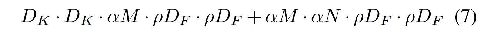

## ShuffleNet
### Main idea
- ShuffleNet utilizes three proposed operations, including pointwise group convolution, channel shuffle and depthwise separable convolution, to greatly reduce computation cost while maintaining accuracy.
### Motivation
- Author pursues the best accuracy in very limited computational budgets at tens or hundreds of MFLOPs, focusing on common mobile platforms such as drones,robots, and phones.
- Many existing works focus on pruning, compressing, or low-bit representing a “basic" network architectur, while author aims to explore a highly efficient basic architecture specially designed for desired computing ranges.
### Architecture

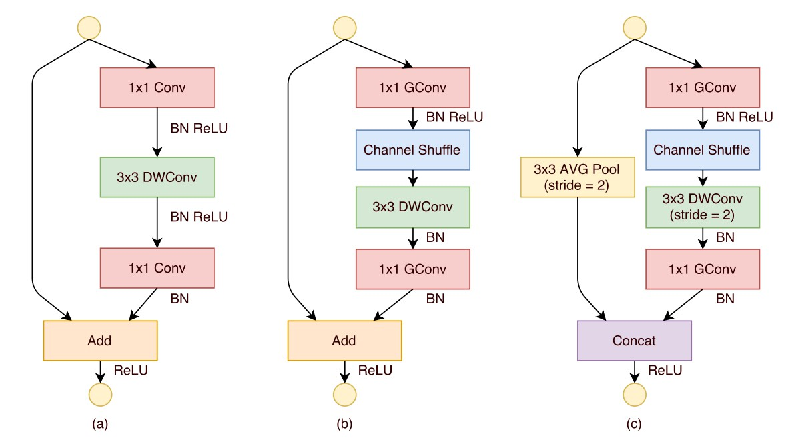

- Pointwise group convolutions. Because some state-of-the-art basic architectures such as Xception and ResNeXt become less efficient in extremely small networks because of the costly dense 1×1 convolutions, author proposes using pointwise group convolutions instead to reduce computation complexity.
- Channel shuffle. If multiple group convolutions stack together, there is one side effect: outputs from a certain channel are only derived from a small fraction of input channels. To overcome the side effects brought by pointwise group convolutions, we come up with a novel channel shuffle operation to help the information flowing across feature channels.Operation details: first reshape the output channel dimension into (g; n), transpose and then flatten it back as the input of next layer.
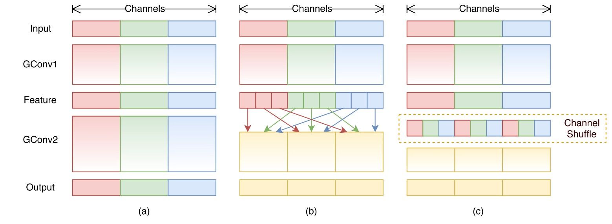
- Depthwise separable convolution. Depthwise separable convolution is proposed in Xception, but separable operation is substituted by pointwise group convolutions to reduce computation complexity.  The purpose of the second pointwise group convolution is to recover the channel dimension to match the shortcut path. In addition, in ShuffleNet depthwise convolution only performs on bottleneck feature maps. Even though depthwise convolution usually has very low theoretical complexity, it is difficult to efficiently implement on low-power mobile devices.
- Given the input size c × h × w and the bottleneck channels m, ShuffleNet unit requires only hw(2cm=g + 9m) FLOPs, where g means the number of groups for convolutions. In other words, given a computational budget, ShuffleNet allows more feature map channels, which helps to encode more information and is especially critical to the performance of very small networks.

## DPN
### Main idea
- By revealing the equivalence of the state-of-the-art ResNet and DenseNet within the HORNN framework, we find that ResNet enables feature re-usage while DenseNet enables new features exploration which are both important for learning good representations.
- Dual Path Network shares common features while maintaining the flexibility to explore new features through dual path architectures.
- The proposed DPN enjoys higher parameter efficiency, lower computational cost and lower memory consumption, and being friendly for optimization compared with the state-of-the-art classification networks.
### Movtivation
- By exploring the advantages and limitations of both topologies in ResNet and DenseNet, from the tens of a higher order HORNN, author finds that the deep residual networks implicitly reuse the features through the residual path while densely connected networks keep exploring new features through the densely connected path.
- Exploring details.\
 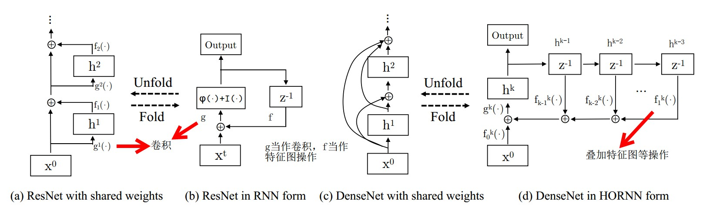
 The formula of RNN are showed, where f(·) corresponds to the first 1 × 1 convolutional layer and the g(·) corresponds to the other layers within a micro-block.
 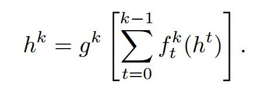\
 For HORNN, weights are shared across steps including f and g. For ResNet, only weights of f are shared, which encourages the feature reusage and thus reduces the feature redundancy. For DenseNet, both weights of f and g are not shared, where the densely connected networks are able to explore new information from previous outputs.
 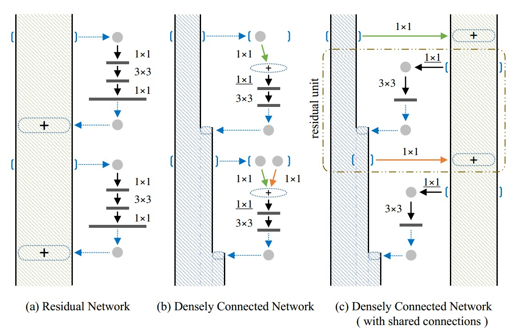\

 ### Architecture
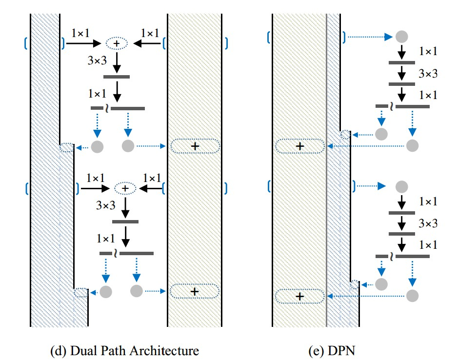
- In this work, the structure of each micro-block is designed with a bottleneck style which starts with a 1×1 convolutional layer followed by a 3×3 convolutional layer, and ends with a 1×1 convolutional layer.
- The output of the last 1 × 1 convolutional layer is split into two parts: the first part is element-wisely added to the residual path, and the second part is concatenated with the densly connected path.
- To enhance the leaning capacity of each micro-block, author use the grouped convolution layer in the second layer as the ResNeXt.
- Author chooses the residual network as the backbone and add a thin densely connected path to build the dual path network.
 
 ## Squeeze-and-Excitation Networks
 ### Main idea
- In this work, we focus on channels and propose a novel architectural unit, which we term the “Squeeze-and-Excitation”(SE) block, that adaptively recalibrates channel-wise feature responses by explicitly modelling interdependencies between channels. 
- SENet generalise extremely well across challenging datasets and produce significant performance improvements for existing state-of-the-art deep architectures at slight computational cost. 
 ### Motivation
- Convolutional neural networks are built upon the convolution operation, which extracts informative features by fusing spatial and channel-wise information together within local receptive fields. The performance of networks can be improved by explicitly embedding learning mechanisms that help capture spatial correlations, such as embedding multi-scale processes like Inception, modeling spatial dependence and incorporating spatial attention.
- Sevaral ways to tune the functional form of the modular components of a network, such as grouped convolutions, multi-branch convolutions and cross-channel correlations, reflect an assumption that channel relationships can be formulated as a composition of instance-agnostic functions with local receptive fields. In contrast, author claim that providing the network with a mechanism to explicitly model dynamic, non-linear dependencies between channels using global information can ease the learning process, and significantly enhance the representational power of the network.
- Attention can be viewed, broadly, as a tool to bias the allocation of available processing resources towards the most informative components of an input signal. Contrast to introducing an attention mechanism,  SE-block is a lightweight gating mechanism,specialised to model channel-wise relationships in a computationally efficient manner and designed to enhance the representational power of modules throughout the network.
- For a standard convolution, the output is produced bya summation through all channels, the channel dependencies are implicitly embedded in filters, but these dependencies are entangled with the spatial correlation captured by the filters. Each of the learned filters operate with a local receptive field and consequently each unit of the transformation output U is unable to exploit contextual information outside of this region.
 ### Architecture
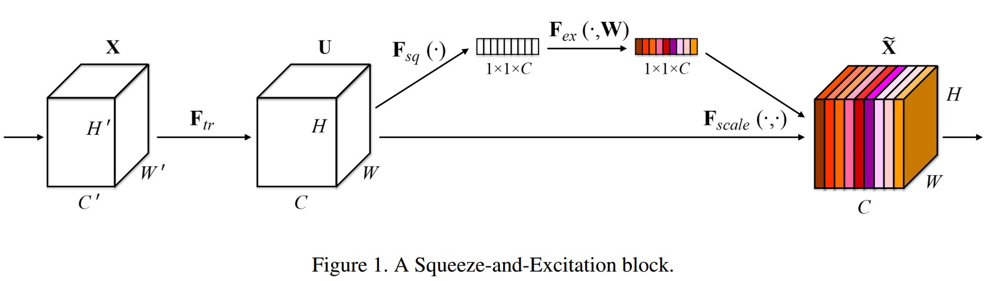

- For any given transformation (e.g. a convolution or a set of convolutions such as residual block and Inception)\
 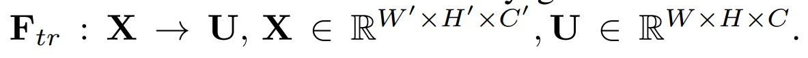
  Author constructs a corresponding SE block to perform feature recalibration as follows.The features U are first passed through a squeeze operation, which aggregates the feature maps across spatial dimensions W × H to produce a channel descriptor. This is followed by an excitation operation, in which sample-specific activations, learned for each channel by a self-gating mechanism based on channel dependence, govern the excitation of each channel. The feature maps U are then reweighted to generate the output of the SE block which can then be fed directly into subsequent layers.
- Squeeze: Global Information Embedding. Squeeze global spatial information into a channel descriptor is achieved by using global average pooling to generate channel-wise statistics. 
 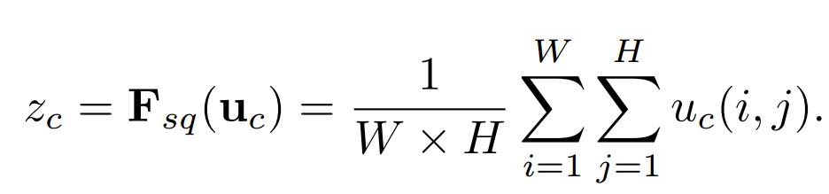
-  Excitation: Adaptive Recalibration. To fully capture channel-wise dependencies, the function must meet two criteria: first, it must be flexible (in particular, it must be capable of learning a nonlinear interaction between channels) and second, it must learn a non-mutually-exclusive relationship as multiple channels are allowed to be emphasised opposed to onehot activation. Author parameterise the gating mechanism by forming a bottleneck with two fully-connected (FC) layers, a ReLU  a Sigmoid and rescaling operation.
 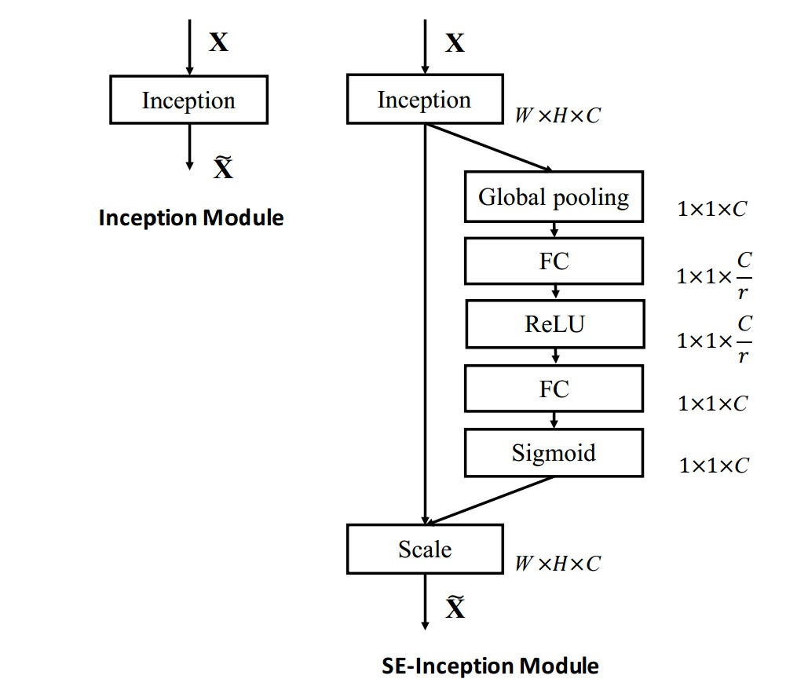
 The reduction ratio r introduced in FC is an important hyperparameter which allows us to vary the capacity and computational cost of the SE blocks in the model. It is found that r = 16 achieved a good tradeoff between accuracy and complexity.